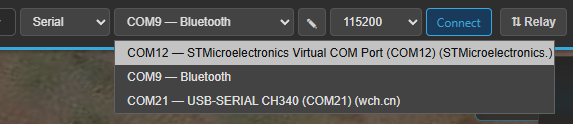
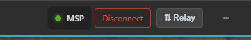

# Your first connection

This walkthrough gets you connected once, the simplest way: a flight controller plugged into your PC
over **USB**. For every other option — Bluetooth, network (TCP/UDP), BLE, and the passive/relay
link modes — see the **[Connecting guide](../guides/connecting.md)**.

## Before you start

- A flight controller running **INAV**, **ArduPilot**, or **PX4**.
- A **USB cable** between the FC and your PC (use the FC's USB port; power the craft if it needs it for
  GPS/peripherals — but **remove propellers** while bench-testing).

!!! note "No COM port showing up?"
    Most flight controllers appear as a serial/COM port automatically. Some USB-to-serial adapters
    (e.g. CP210x, CH340) need a one-time driver from the chip vendor. If the port list stays empty,
    see **[Troubleshooting → Connection](../troubleshooting/connection.md)**.

## Connect, step by step

The connection controls live in the **top bar** (right-hand side) whenever you're disconnected.

/// caption
The connection controls in the top bar: protocol, transport, port, baud, and **Connect**.
///

1. **Plug in** the flight controller with USB and wait a few seconds for your PC to recognise it.

2. **Choose the protocol** for your autopilot:

    | Your FC | Protocol |
    |---|---|
    | INAV | **MSP** |
    | ArduPilot / PX4 | **MAVLink** |

    (The third option, **Telemetry**, is a passive listen-only mode — covered in the Connecting guide.)

3. **Transport** — leave it on **Serial** (the default).

4. **Pick your port** from the port dropdown.

    !!! tip
        Not sure which one it is? Open the dropdown, unplug the FC, reopen it — the entry that
        disappears is your board. Plug it back in and select it. The list refreshes on its own.

    

    *Here: a Virtual COM Port (the flight controller), a Bluetooth COM port, and a CH340 USB-serial
    adapter — pick the one that matches your board.*

5. **Baud rate** — leave the default. Kite sets it for you when you pick the protocol:
   **115200** for MSP, **57600** for MAVLink. Only change it if you've set a non-standard rate on the FC.

6. Click **Connect**.

## What you should see

/// caption
Connected: the link indicator turns green and **Connect** becomes **Disconnect**.
///

- The button shows **Connecting…**, then switches to **Disconnect** once the link is up.
- The **top bar** comes alive: arming readiness, per-sensor status, battery, and link quality.
- The **flight widgets** start showing live values (attitude, altitude, speed, …).
- Once the FC has a **GPS fix**, your aircraft appears on the **map**.

That's it — you're connected. 🎉

## Disconnect

Click **Disconnect** in the top bar. Kite remembers your **port, baud, protocol and transport**, so
next time you can usually just press **Connect** straight away.

## It didn't connect?

A few common causes — wrong baud rate, the port already in use by another app (INAV Configurator,
Mission Planner…), a Bluetooth COM port, or a missing USB-serial driver. The
**[Troubleshooting → Connection](../troubleshooting/connection.md)** page walks through each.

## Next steps

- Learn every connection option (Bluetooth, TCP/UDP, BLE, passive & relay) in the
  **[Connecting guide](../guides/connecting.md)**.
- New to the layout? Take the **[quick tour](quick-tour.md)**.
