# Quick tour

A two-minute look at the Kite interface, so you know where everything lives. Don't worry about the
details here — each area has its own guide; this is just the map of the cockpit.

/// caption
The main interface, with the numbered regions described below.
///

## The layout at a glance

The window is built from a few fixed regions around a full-screen map:

| # | Region | What it's for |
|---|---|---|
| **1** | **Top bar** | Connecting, plus aircraft / sensor / battery status |
| **2** | **Navigation rail & panel** | The tool rail (left edge) and the panel it opens |
| **3** | **Right widget dock** | Flight instruments down the side |
| **4** | **Bottom widget dock** | Flight instruments along the bottom |
| **5** | **Map controls** | Switch 2D/3D, follow mode, zoom |
| — | **Map** | Fills the background: your aircraft, track, home and mission |
| — | **Status bar** | The thin strip at the very bottom: connection & arming state |

## 1 · Top bar

The command centre. From left to right:

- **Brand & version** — the Kite logo and the running version.
- **Aircraft status (centre)** — the **arming indicator**, a row of **sensor-health tiles** (gyro, acc,
  mag, baro, GPS, and rangefinder/airspeed when fitted — green = OK, amber = warning, red = fault), and
  the **battery** readout. Tiles only appear for sensors your craft actually reports, so the row adapts
  to the airframe.
- **Connection controls (right)** — protocol, transport and port while disconnected; once connected
  they're replaced by the live link status and a **Disconnect** button. See the
  **[Connecting guide](../guides/connecting.md)**.
- **⇅ Relay** — opens the telemetry **[relay/forwarding](../guides/relay-and-forwarding.md)** dropdown.
- **Window controls** — minimise / maximise / close.

## 2 · Navigation rail & panels

The strip down the **left edge** is the navigation rail. Click an icon to open its **panel**; click it
again (or the rail's toggle) to close. Only one panel is open at a time, and the map stays live behind
it. Some tools appear **only when relevant** (e.g. *Control* only on an ArduPilot/PX4 link), so the rail
stays uncluttered.

Each tool, at a glance — expand for a quick description and the link to its full guide:

??? note "UAV Info"
    Flight-controller identity (firmware variant, version, board) and live vehicle status — a quick
    read-out of what you're connected to and how it's doing.

    

    *Details: [Telemetry & display](../guides/telemetry-and-display.md).*

??? note "Mission"
    Plan a waypoint mission: add, edit and reorder waypoints, set altitudes (incl. AGL /
    terrain-following), generate survey patterns, undo/redo, and upload / download to the aircraft.
    Includes the reusable mission library.

    

    *Details: [Missions](../guides/missions.md).*

??? note "Control (ArduPilot / PX4)"
    Send vehicle commands over MAVLink — arm / disarm, change flight mode, take off, RTL, loiter and
    more. Only shown when connected to an ArduPilot or PX4 vehicle.

    <!-- SCREENSHOT: ../assets/getting-started/panels/control.png -->

??? note "RC"
    Fly from the GCS with a gamepad or joystick: map your controller's axes/buttons to RC channels and
    manage control profiles. Only shown when RC control is enabled (and not on a passive telemetry link).

    <!-- SCREENSHOT: ../assets/getting-started/panels/rc-control.png -->

    *Details: [RC control](../guides/rc-control.md).*

??? note "Terrain"
    A terrain-profile analysis of your planned mission or a recorded track — see the ground elevation
    beneath the route and check your above-ground clearance.

    

    *Details: [Missions](../guides/missions.md).*

??? note "Logbook"
    Your flight history: automatic recordings with replay, plus import of INAV blackbox, ArduPilot
    Dataflash, MAVLink `.tlog` and MWPTools raw-MSP logs. Add notes and weather, and reach the **Vehicle**
    and **Battery** managers from here.

    

    *Details: [Logbook](../guides/logbook.md) · [Vehicles](../guides/vehicles.md) · [Batteries](../guides/batteries.md).*

??? note "Radar"
    Foreign-vehicle radar — show nearby ADS-B (and other) traffic on the map, with proximity and
    conflict alerts. Only shown when radar is switched on.

    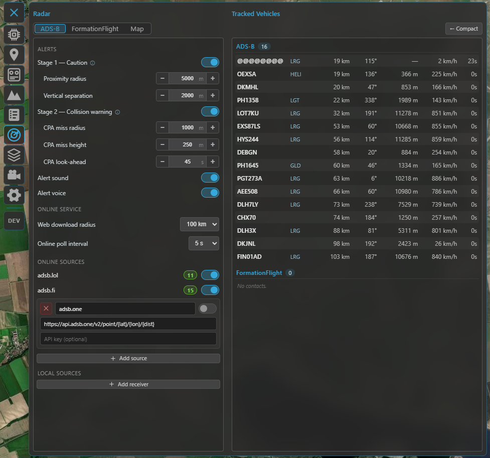

    *Details: [Radar & ADS-B](../guides/radar-and-adsb.md).*

??? note "Airspace"
    Aeronautical overlays (airports, controlled airspace and obstacles), plus the editors for INAV
    **geozones** and ArduPilot/PX4 **geofences**. Shown when the overlay is on, or when a connected FC
    supports geozones/geofences.

    

    *Details: [Safety](../guides/safety.md).*

??? note "Video"
    Set up and watch a live RTSP video feed alongside (or behind) the map, with one-click map ⇄ video
    swapping.

    

    *Details: [Video](../guides/video.md).*

??? note "Settings"
    Everything configurable — units, map provider, telemetry rates, flight logging, language, widget
    selection and more.

    

    *Details: [Settings reference](../reference/settings.md).*

## 3 & 4 · Widget docks

Two docks hold your **flight widgets** (attitude, altitude, speed, compass, and more): the **right
dock** (3) down the side, and the **bottom dock** (4) along the bottom.

Click the **✎ (edit) button** by a dock to enter **edit mode**, then drag widgets to rearrange them or
move them between docks. Choose which widgets appear in **Settings → Interface**. Widgets scale to fit
the dock, and your layout (including which dock each sits in) is remembered between sessions. Every widget
follows your global units and works the same **live** and in **[replay](../guides/logbook.md)**.

Each widget, at a glance — expand for what it shows and how it works:

??? note "AHI — Artificial Horizon"
    A circular attitude indicator: the horizon line moves with **pitch** and banks with **roll** around a
    fixed aircraft symbol. A **flight-path-vector marker** shows where the aircraft is actually going —
    offset from the symbol by **angle of attack** (vertically) and **crab** (laterally) — smoothed so it
    reads cleanly.

    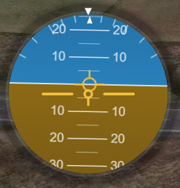

??? note "Speed"
    The big number is **airspeed** when the aircraft reports it (what matters in flight), with **ground
    speed** on a second line; without an airspeed sensor, ground speed is the primary number. A
    **throttle bar** (0–100 %, from the FC) sits on the left and a **derived acceleration bar** on the
    right (±4 m/s², estimated from the speed trend — no number, just a bipolar bar from centre).

    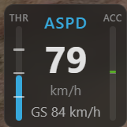

??? note "Altitude"
    The aircraft's altitude (barometric / navigation, relative to home), switching to **km** above
    999 m to stay compact. Below it, a **vario** read-out with an ▲ / ▼ trend arrow and colour for climb
    / sink.

    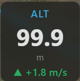

??? note "Battery"
    A **charge bar** (the FC's battery percentage, shown when the FC reports one) plus **voltage**,
    **current**, **power (V × A)** and **charge drawn (mAh)**. On multi-battery ArduPilot / PX4 aircraft
    it shows one pack with an **AUTO** selector that follows the **highest-draw** pack (with a short
    hysteresis so it doesn't flicker), a **low-battery safety override** (jumps to the lowest pack once one
    drops below the **Battery alert** threshold), and **manual pinning** (click the **BAT** label to cycle
    AUTO → pack 1 → pack 2 → …). Single-battery setups (INAV) just show the one pack. The charge figure is
    the **FC's** percentage when available, otherwise the **voltage** (no guessed % from voltage). Add a
    second **Battery 2** widget to watch two packs at once (e.g. a QuadPlane's forward and lift packs).
    See **[Batteries](../guides/batteries.md)**.

    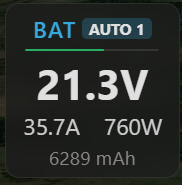

??? note "GPS"
    **Latitude / longitude**, **satellite count**, **fix type** (No fix / 2D / 3D / 3D DGPS, colour-coded)
    and **HDOP**.

    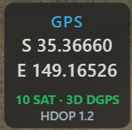

??? note "RC Link"
    An adaptive radio-link read-out — it shows whatever the active protocol provides and hides the rest:
    **LQ** (link quality), **RSSI** (in % and dBm) and **SNR**. What you get depends on the link:
    **CRSF**, **SmartPort** and **INAV 9.1+** give the full set (LQ + RSSI %/dBm + SNR), while **MAVLink
    (ArduPilot / PX4)**, **LTM** and **INAV before 9.1** report **RSSI only** — so that's all the widget
    shows there. The primary value is colour-coded green / amber / red by strength.

    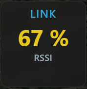

??? note "Compass"
    A rotating compass rose with the **heading** at the centre and a fixed top pointer. While moving, an
    amber **course-over-ground bug** rides the rim — the gap between it and the nose is your **crab
    angle** — and the COG value is read out above the heading. When the aircraft reports wind, a blue
    **wind arrow** (pointing downwind) and the wind speed appear.

    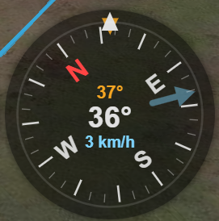

??? note "Home"
    A large **arrow** pointing to the home / launch point relative to the aircraft's heading, with the
    **distance** and **bearing** to home. Appears once the flight controller has set home.

    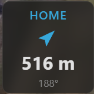

??? note "Flight Mode"
    The current **flight mode** as a badge. Kite maps every stack's modes onto one **protocol-agnostic**
    model, so INAV, ArduPilot and PX4 read consistently: the **exact mode name** is always kept (e.g.
    *Angle*, *Cruise*, *RTL*, *FBW-A*, *QLoiter*), while the **badge colour** comes from the mode's
    **category** — the *same* colour scheme used to colour the flight track on the map. Roughly:
    stabilized = green, altitude-hold = yellow, position-hold = teal, cruise = orange, mission = blue,
    guided = blue, RTH / return = violet, launch / takeoff = magenta, land = orange, failsafe = red,
    manual = grey, acro = light grey.

    INAV's (and PX4's) **main mode + sub-modes** are shown together: the **primary** mode is the badge,
    and any active **modifiers** (AltHold, Heading, HeadFree, Soaring, Autoland, …) appear as small chips
    beside it. During a mission the badge also shows the FC's current target as **WP N/X**.

    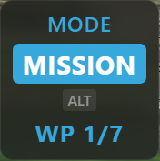

??? note "Raw Telemetry"
    A compact numeric dump for when you want the raw figures at a glance: altitude, speed, vario, heading,
    roll, pitch, voltage, current, mAh, satellites and RSSI.

    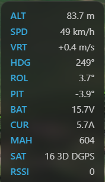

??? note "Live AGL"
    A forward-looking **terrain-profile HUD** (a wide widget). The left third shows the terrain you've
    flown over with the aircraft riding at its current height; the right two-thirds shows the
    **estimated** terrain ahead along your heading, with a dashed **projected flight line** so you can see
    a climb, descent or ground intersection coming. Centre read-outs give **AGL** and **minimum clearance
    ahead** (red when it goes negative). Works live and in replay.

    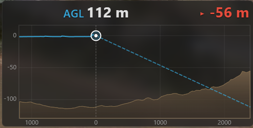

??? note "Terrain Radar"
    A top-down, **track-up** terrain-awareness display in the style of an airliner's EGPWS: a forward fan
    coloured by **clearance** against your altitude (red = at/above you → green = well below). Two
    independent ranges — the **fan distance** scales with speed, and a separate **clearance colour scale**
    (60 / 120 / 250 m, left button). A **REL / PRED** button (right) switches the reference between your
    current altitude and a sink-rate-predicted one.

    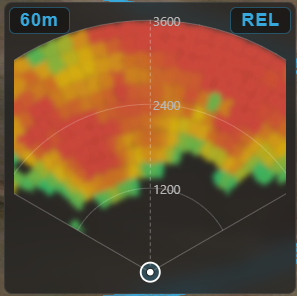

??? note "Video"
    A live **video feed** embedded as a widget — an RTSP stream or a local capture device / camera (e.g. a
    USB capture card), sized to the stream's aspect ratio. **Double-click** it to swap the feed with the
    map. See **[Video](../guides/video.md)**.

    <!-- SCREENSHOT: ../assets/getting-started/widgets/video.png -->

## 5 · Map & its controls

The map fills the whole background and is always interactive — pan and zoom around it even with a panel
open. A small cluster of buttons sits in one **corner of the map** (5):

- **2D / 3D** — switch between the flat moving map and the full 3D globe. (The button shows the mode
  you'll switch *to*.)
- **Follow mode** — cycles **Free → Follow → Heading-up**: free panning, keep the aircraft centred, or
  centre *and* rotate the map to the aircraft's heading.
- **Zoom + / −** — zoom the map (the mouse wheel works too).

The 3D view has more of its own controls — see the **[3D map guide](../guides/map-3d.md)**.

## Status bar

The thin strip along the very **bottom**:

- **Left** — a connection dot (green = connected, red = not) and, once connected, the firmware variant,
  version and port (e.g. *INAV 8.0.0 on COM7*).
- **Right** — the **arming state** (ARMED / DISARMED) while connected.

## Where to go next

- Get linked up: **[Connecting](../guides/connecting.md)**.
- Make sense of the instruments: **[Telemetry & display](../guides/telemetry-and-display.md)**.
- Plan a flight: **[Missions](../guides/missions.md)**.
