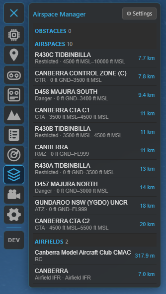
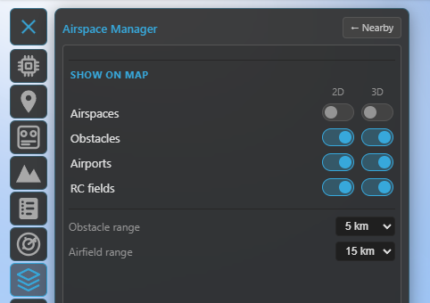
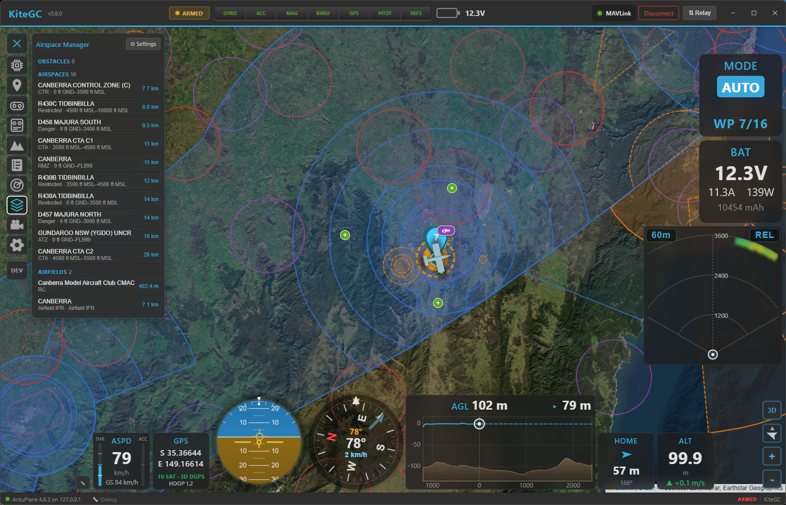
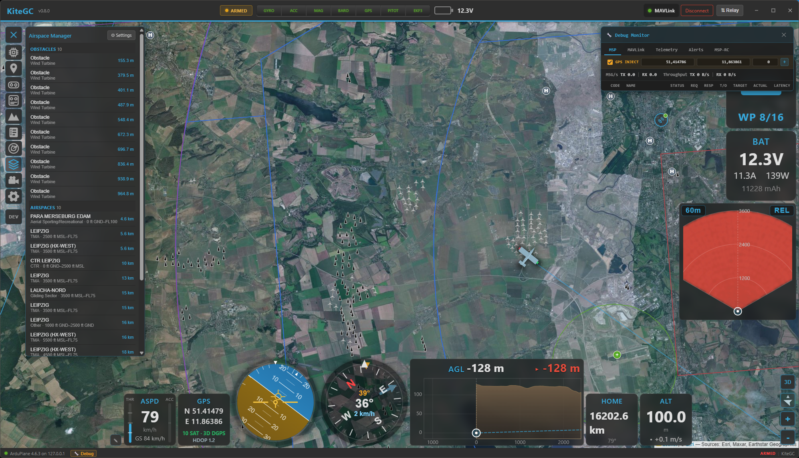

# Airspace Manager

The **Airspace Manager** overlays **aeronautical data** — airspaces, obstacles, airports and model
airfields — on the 2D map and the 3D globe, and lists what's near you. It's the *static* counterpart to
[Radar & ADS-B](radar-and-adsb.md): Radar shows moving aircraft, the Airspace Manager shows the fixed
features of the airspace around you.

The same panel is also where you edit the flight controller's own keep-in / keep-out areas — **geozones**
(INAV) and the **geofence** / **rally points** (ArduPilot / PX4). Those are covered in
**[Safety](safety.md)**; this page is about the **aeronautical overlay**.

Open it from the **Airspace** tool on the navigation rail.

## Setting it up (OpenAIP)

The aeronautical data comes from **[OpenAIP](https://www.openaip.net/)**, which needs a free account and
an API key. In **Settings → Data**:

1. **Enable** the airspace feature (this reveals the Airspace tool on the navigation rail).
2. Set the **provider** to **OpenAIP**.
3. Paste your **OpenAIP API key**.

!!! note "Your key, your licence"
    OpenAIP is free for **non-commercial** use with a user-supplied key — the licence obligation is
    yours. Get a key from your OpenAIP account. Data is © OpenAIP contributors.

## The panel

The panel switches between **two views** in its header — there's no split layout, so the map stays as
large as possible (this changed when the FC airspace editors were added):

- **Nearby** (the info view) — a list of the features around you, grouped **Obstacles · Airspaces ·
  Airfields**, distance-sorted and capped to the nearest few per group within range. **Click an entry**
  to centre the map on it and highlight it. Each entry shows the relevant detail (obstacle height,
  airspace floor/ceiling, field type).
- **Settings** (the compact view) — the per-layer visibility and ranges (in a **Show on map** group),
  plus the FC airspace editors at the top.

/// caption
The Nearby view: features around you grouped into Obstacles, Airspaces and Airfields — click one to
centre and highlight it on the map.
///

/// caption
The Settings view: the FC airspace editors on top and the per-layer 2D / 3D visibility + ranges in the
"Show on map" group.
///

## The layers

Four aeronautical layers, each with **separate 2D and 3D visibility** toggles (so you can show airspaces
on the flat map but only obstacles in 3D, for example):

- **Airspaces** — controlled/restricted/danger zones and the like, drawn as **class-coloured polygons**
  with their floor/ceiling altitudes. In 2D **all** of them show (subject to zoom, below); in **3D** only
  the ones **relevant to your aircraft** are drawn as floor-to-ceiling volumes (within ~500 m above, ~5 km
  laterally, or whichever you're inside) — this keeps the globe readable.
- **Obstacles** — wind turbines, masts, towers, chimneys and cranes, with a type icon and height. In
  **3D** each becomes a **vertical column** from the ground to its top; obstacles with no published
  height get a clearly-distinct *estimated* column. Critical for low flying.
- **Airports** — typed markers (international / airport / airfield / heliport), as ground markers in 3D.
- **RC fields** — model / RC flying sites.

/// caption
A wide view: airspaces drawn as class-coloured zones with their boundaries.
///

## Ranges & decluttering

- **Render / list ranges** — set how far out **obstacles** and **airfields** are fetched and listed
  (1–25 km) in the Settings view, so you only see what's near your operating area.
- **Zoom-based density** — like the OpenAIP map, features appear by importance as you zoom: zoomed out you
  see only the big things (major airspaces, international airports); smaller fields, sectors and obstacles
  fill in as you zoom in. The Nearby list is **not** zoom-filtered — it always browses the closest
  features.

/// caption
Zoomed in over an operating area: obstacles (and other close-range features) now appear alongside the
airspaces.
///

Aeronautical data is **static**, so Kite caches the surrounding region and only refetches when you move
well outside it — no constant polling.

## The FC airspace editors (cross-reference)

The same panel hosts the editors for the airspace your **flight controller** enforces:

- **Geozones** (INAV) — keep-in / keep-out zones with per-zone altitude bands and breach actions.
- **Geofence** and **Rally points** (ArduPilot / PX4).

These are full editors (draw on the map, upload to the FC) and are documented in **[Safety](safety.md)**.

## Where to go next

- Moving traffic and collision alerts: **[Radar & ADS-B](radar-and-adsb.md)**.
- The FC's own zones and fences: **[Safety](safety.md)**.
- See it all in 3D: **[3D map](map-3d.md)**.
