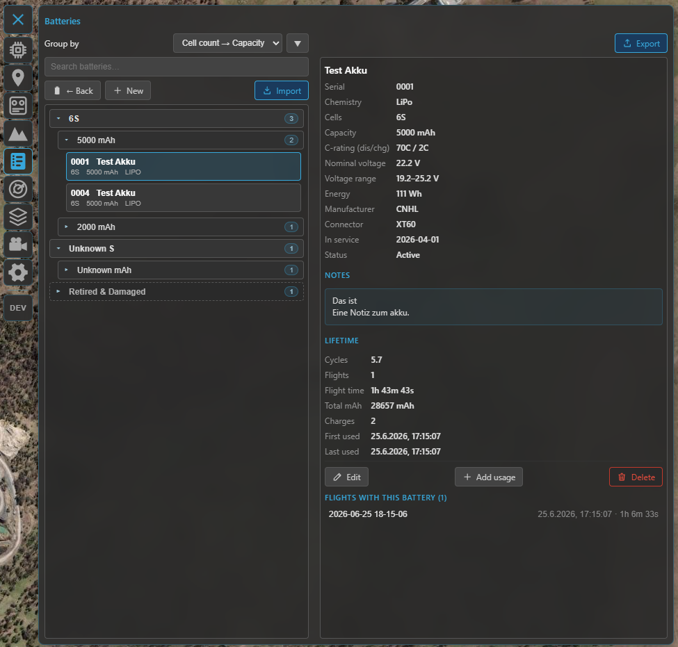

# Batteries

The battery library tracks each of your packs — its spec, its **lifetime usage**, and the flights it
flew. Like the [vehicle library](vehicles.md) it's a subfeature of the **[logbook](logbook.md)**: open it
with the **Batteries** button in the logbook toolbar.

## The pack list

Packs are grouped (by cell count and capacity) and **searchable** (serial, label, maker, model, notes,
connector, chemistry). Pick one to open its detail; the toolbar creates a new pack and imports one from
a file.

/// caption
The battery library: the grouped pack list (left) and the selected pack's detail — spec, computed
voltage / energy, lifetime totals and linked flights (right).
///

## The pack record

Each pack stores:

- **Serial** — the unique ID and the **link key** to flights (upper-case letters + digits). A printed
  label / sticker on the pack makes this easy.
- **Identity** — label, manufacturer, model, **status** (active, storage, retired, damaged), connector
  (XT60, XT90, …), in-service date and notes.
- **Spec** — **chemistry** (LiPo, Li-ion, …), **cell count**, **capacity** (mAh) and the discharge /
  charge **C-ratings**. From the chemistry and cell count Kite shows the pack's **nominal / min / max
  voltage** and its **energy** (Wh).

## Lifetime tracking

Each pack accumulates **lifetime totals** — flight count, flight time, energy drawn (mAh) and
charge / cycle counts — built from the flights linked to it. You can also:

- **Add usage** — enter manual deltas (e.g. bench cycles, or flights from before you used Kite).
- **Baseline** — set a starting point so the totals reflect the pack's whole life.

## Linking to flights

Flights link to a pack by **serial**. A single flight can link **several** packs by listing their
serials **comma-separated** — handy for a parallel pair or a multi-battery aircraft (see the per-instance
telemetry in **[Telemetry & display](telemetry-and-display.md)**). Each pack then lists its **linked
flights** and rolls their energy into its lifetime totals. The **post-flight summary** is where you
record the pack(s) you flew and the energy used; you can also edit the link later from the flight detail.

When you delete a flight you can choose to **consolidate** its battery usage into the pack's lifetime
totals first, so the history isn't lost.

## Import & export

Move a pack between installs (or back it up) with a **`.kbatt`** file. On **export** you can either keep
just the baseline or **consolidate** the linked flights into it; on **import** you get a preview, and if
the serial already exists you're asked to resolve it.

## The live battery widget

In flight, the **Battery** widget shows the live pack — voltage, current, power and charge — and on
multi-battery ArduPilot / PX4 aircraft it follows the highest-draw pack automatically. That's covered in
**[Telemetry & display](telemetry-and-display.md)**; this page is about the stored library.

## Where to go next

- Where batteries link from: **[Flight logbook](logbook.md)**.
- The other logbook library: **[Vehicles](vehicles.md)**.
- The live readout: **[Telemetry & display](telemetry-and-display.md)**.
