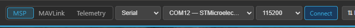
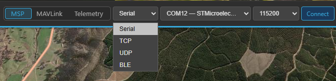
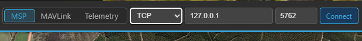
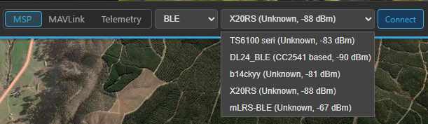

# Connecting

This is the complete reference for every way Kite can link to an aircraft. If you just want to get
connected over USB the first time, the **[first-connection walkthrough](../getting-started/first-connection.md)**
is the short version — this page covers all the transports and link modes in detail.

All connection controls live in the **top bar**, on the right, and only while you're **disconnected**.
Once connected, they're replaced by the link status and a **Disconnect** button.


/// caption
The connection controls: **protocol**, **transport**, and the transport-specific fields, then **Connect**.
///

## The two choices: protocol and transport

Every connection is defined by two independent picks:

- **Protocol** — *what language* the link speaks: **MSP**, **MAVLink**, or **Telemetry** (passive).
- **Transport** — *how the bytes travel*: **Serial**, **TCP**, **UDP**, or **BLE**.

They're independent: you can run MSP over Bluetooth, MAVLink over TCP, passive telemetry over a serial
adapter, and so on.

### Protocol

| Protocol | Use it for | Direction |
|---|---|---|
| **MSP** | INAV flight controllers (7.0+) | Two-way (Kite polls the FC) |
| **MAVLink** | ArduPilot and PX4 | Two-way |
| **Telemetry** | A passive, listen-only downlink (SmartPort, CRSF, LTM, MAVLink) | **Receive only** — Kite never transmits |

The first two are normal bidirectional control links. **Telemetry** is special — see
[Passive telemetry](#passive-telemetry-listen-only) below.

### Transport

Pick the transport from the dropdown; the fields next to it change to match.

```
Serial → port + baud (+ rename button for Bluetooth ports)
TCP    → host + port
UDP    → host + port
BLE    → device list (live scan)
```

## Serial (USB & Bluetooth SPP)

Serial is the default and covers both **USB cables** and **Bluetooth SPP** (classic Bluetooth serial)
COM ports — Windows and Linux present both as serial ports.

1. **Transport** → **Serial**.
2. **Port** — pick it from the list. The list refreshes by itself; a freshly plugged-in board is
   auto-selected. (Unsure which port is yours? Open the dropdown, unplug the board, reopen — the entry
   that vanished is it.)
3. **Baud rate** — Kite presets it when you choose the protocol: **115200** for MSP, **57600** for
   MAVLink. Change it only if your FC/link uses a non-standard rate. Available rates: 9600, 19200,
   38400, 57600, 115200, 230400, 460800, 921600.
4. **Connect**.

!!! tip "Port already in use"
    A serial port can only be opened by **one** application at a time. If INAV Configurator, Mission
    Planner, or another GCS is connected to the same port, close that connection first.

### Bluetooth SPP ports

A paired Bluetooth-SPP device shows up as a normal COM port (Windows) or `rfcomm`/`tty` device (Linux).
Kite recognises Windows Bluetooth-SPP ports and:

- **Hides the incoming (local-server) port** automatically, so you only see the **outgoing** port you
  actually connect through — no more guessing which of the two paired COM ports to use.
- **Lets you give it a friendly name.** Bluetooth COM ports have no useful OS description, so a port
  shown as just `COM7 — Bluetooth` can be renamed (the ✎ button next to the port). The name is
  remembered per port and shown as `COM7 — My Wing`.

!!! warning "First connection over Bluetooth fails with a timeout?"
    Bluetooth-SPP links sometimes fail the very first open with a Windows *“semaphore timeout”* (error
    121) while the radio brings the channel up. Kite retries the open automatically. If it still fails,
    see **[Troubleshooting → Connection](../troubleshooting/connection.md)**.


/// caption
The transport dropdown: **Serial**, **TCP**, **UDP**, or **BLE**.
///

## TCP and UDP (network links)

For network links — a SITL simulator, a companion computer, a Wi-Fi/serial bridge, or a MAVLink router
forwarding to your PC.

1. **Transport** → **TCP** or **UDP**.
2. **Host** — the IP address or hostname to reach (e.g. `127.0.0.1` for a local simulator, or the
   bridge's LAN address).
3. **Port** — the network port.

Kite fills in the usual MAVLink defaults and swaps them when you flip between TCP and UDP:

| Transport | Default port | Typical use |
|---|---|---|
| **TCP** | `5761` | Local MAVLink endpoint |
| **UDP** | `14550` | The standard MAVLink GCS port |

A custom port you've typed (for example **SITL on `5762`**) is left untouched when you switch transport.

!!! note "Protocol still applies"
    Choose the matching **protocol** for a network link too — **MAVLink** for an ArduPilot/PX4
    simulator or router, **MSP** for an MSP-over-TCP bridge.


/// caption
With TCP or UDP selected, the port fields become a **host** and a **port**.
///

## BLE (Bluetooth Low Energy)

For BLE-to-serial adapters — the same kind INAV Configurator supports.

1. **Transport** → **BLE**. Kite starts scanning immediately.
2. Pick your device from the live list. Each entry shows its **name**, the matched **profile**, and the
   **signal strength** (e.g. `SpeedyBee — SpeedyBee Type 2, -67 dBm`).
3. **Connect**.

Recognised profiles: **CC2541-based**, **Nordic NRF (NUS)**, **SpeedyBee Type 1**, and
**SpeedyBee Type 2**. Devices that advertise a name but no known profile are listed as **Unknown** —
you can still try to connect; the profile is matched during the connection. Known profiles are listed
first, then sorted by signal strength.

!!! note "Why some adapters appear late"
    Many BLE serial adapters don't advertise their service UUID until after a connection is opened, so
    Kite scans without a UUID filter and matches the profile on connect. Give the list a moment to
    populate.


/// caption
The live BLE scan: each device shows its name, matched profile, and signal strength.
///

## Passive telemetry (listen-only)

Set the **protocol** to **Telemetry** to monitor a one-way telemetry downlink **without ever
transmitting**. Kite listens on the chosen transport and **auto-detects** the wire format:

- **FrSky SmartPort**
- **TBS Crossfire (CRSF)**
- **LTM** (Light Telemetry)
- **MAVLink** (push-only — Kite decodes the incoming stream but sends **no heartbeat** and never
  requests data)

This is for tapping a telemetry feed — e.g. a SmartPort/CRSF line off your receiver, a ground-side TX
module, or a one-way MAVLink downlink — when you don't have (or don't want) a full control link.
Because nothing is transmitted:

- There's **no handshake** — Kite starts decoding as soon as frames arrive.
- **RC control is unavailable** in this mode (no uplink to send channels), so its tab is hidden while
  passively connected.
- The detected sub-protocol is shown in the connection status box once it locks.

Passive telemetry works over any transport. On **Serial**, set the **baud rate to match your telemetry
source** (e.g. SmartPort and CRSF have their own rates) — it isn't auto-detected.

!!! tip "Recording works in passive mode"
    Flight logging still runs while passively connected — arm/disarm is derived from the decoded
    telemetry, so passively monitored flights land in your **[logbook](logbook.md)** like any other.

## Relay / forwarding (separate from connecting)

The **⇅ Relay** button in the top bar is **not** a connection — it re-encodes your *live* telemetry and
re-broadcasts it to other ground stations, handsets, or an antenna tracker, over a separate output.
It's covered in its own guide: **[Relay & forwarding](relay-and-forwarding.md)**.

## After you connect

- The button becomes **Disconnect**; the top bar shows arming readiness, per-sensor health, battery and
  link quality; widgets start updating; your aircraft appears on the map once it has a GPS fix.
- **INAV/MSP** links additionally download the safe-home/autoland config and (on INAV 8.0+) geozones for
  the map overlay. **MAVLink** links download the geofence and rally points.

## Reconnecting

Kite remembers your last **protocol, transport, port/host, baud, and BLE device**, so reconnecting is
usually a single click on **Connect**. To drop the link, click **Disconnect**.

## Trouble connecting?

Wrong baud rate, a port already held by another app, a Bluetooth first-open timeout, or a missing
USB-serial driver are the usual culprits. The
**[Troubleshooting → Connection](../troubleshooting/connection.md)** page works through each.
