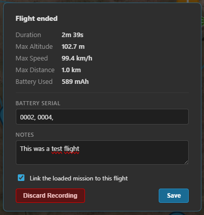
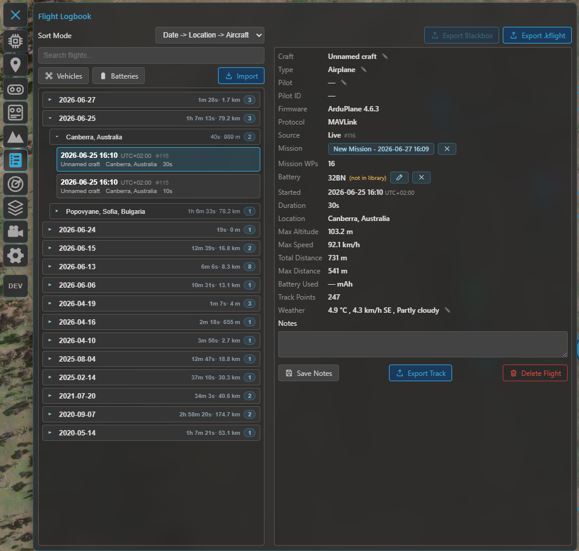
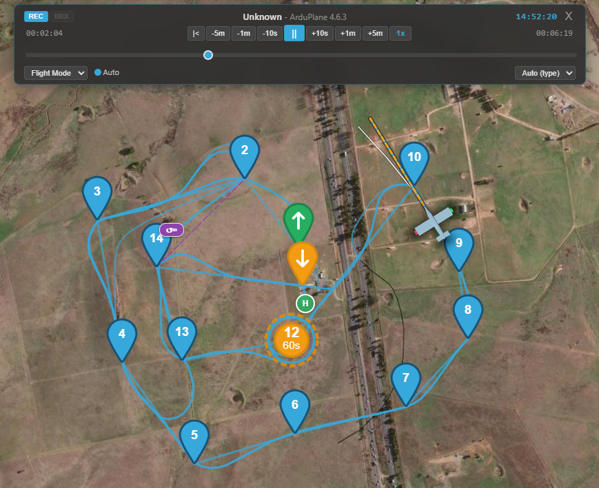

# Flight logbook

The logbook is Kite's flight history: every flight it records (or you import) is stored locally, with
stats, notes, weather and links to the aircraft, batteries and mission used — and you can **replay** any
of them on the map and instruments. It works for **INAV**, **ArduPilot** and **PX4** alike.

Open it from the **Logbook** tool on the navigation rail.

## Recording happens automatically

While you're connected with **flight logging enabled** (Settings), Kite records telemetry in the
background and splits it into flights by **arm → disarm**. When a flight ends you get a short
**post-flight summary** where you can:

- **Save or discard** the flight,
- enter the **battery** you flew (one or several serials, comma-separated — see **[Batteries](batteries.md)**),
- add **notes**, and
- **link the mission** that was loaded.

If the app is closed or the link drops mid-flight, the next start offers to **recover** the interrupted
recording (save / continue / discard) so the flight isn't lost — note that a recording continued after
an interruption will have a **gap** for the time the link was down.

/// caption
The post-flight summary — save or discard, link the battery (one or several serials) and the mission, add notes.
///

## The flight list

Flights are grouped into a collapsible tree you can re-organise with the **sort** selector — by
**aircraft**, **location** and **date** in the order you prefer — and narrow with the **search** box.
Each entry shows the essentials (date, aircraft, location, duration, distance); pick one to open its
details.

## Flight details

The detail panel shows everything about the selected flight:

- **Stats** — duration, max altitude / speed / distance, and more.
- **Aircraft** — the craft name, soft-linked to its entry in the **[Vehicle library](vehicles.md)**.
- **Battery** — the linked pack(s), each as its own chip (open it in the Battery Manager, or shown as
  *not in library*); edit to add or change serials. See **[Batteries](batteries.md)**.
- **Mission** — the linked mission, openable in the Mission Manager.
- **Weather**, **notes** and **pilot** — editable.
- **Source & stored log** — where the flight came from (live recording or an import) and, when an
  onboard log file was kept, an inline control to export or delete it.

/// caption
The logbook view: the flight list (left) and the selected flight's details (right).
///

## Replaying a flight

**Disconnect**, then select a flight and press play: Kite replays the recorded telemetry through the
**same instruments and map** as a live flight. The player gives you **play / pause**, a **timeline**
scrubber and **playback speed**, and the flown **track** can be coloured by flight mode, altitude, speed
or signal. If the flight has a linked mission, it's drawn alongside the track. 3D replay works too — see
the **[3D map](map-3d.md)**.

/// caption
Replaying a recorded flight — the player (play / pause, timeline, speed) drives the same instruments and map.
///

## Importing logs

Use **Import** to pull in logs from outside Kite (one file or a batch). Supported formats:

| Format | From |
|---|---|
| **INAV Blackbox** (`.bbl`, `.txt`) | INAV onboard flash (`.bbl`) or SD-card (`.txt`) blackbox |
| **ArduPilot Dataflash** (`.bin`) | ArduPilot / PX4 onboard logs |
| **MAVLink telemetry** (`.tlog`) | a MAVLink ground-station recording |
| **MWPTools raw-MSP** (`.rawmsp`) | mwp's raw telemetry capture |
| **Kite flight** (`.kflight`) | a flight exported from another Kite install |

A progress bar tracks the import. INAV Blackbox needs the **`blackbox_decode`** helper, which Kite
fetches automatically the first time you import one. Imported telemetry logs (`.tlog` / `.rawmsp`) are
treated as telemetry recordings and **split into separate flights on the arm / disarm markers** in the
log, the same way a live recording is.

## Exporting

- **`.kflight`** — export selected flights (multi-select supported) as Kite's portable flight file, to
  move them to another install.
- **Original log file** — re-export the onboard log stored with the flight: an INAV Blackbox
  (`.bbl` / `.txt`) or ArduPilot Dataflash (`.bin`). Imported `.tlog` / `.rawmsp` telemetry is parsed
  straight in (not kept as a file), so there's nothing to re-export for those.
- **Track** — export a flight's path as **KMZ / KML** (Google Earth), **GPX** or **CSV**.

## Vehicles & batteries

From the logbook toolbar you can open the two libraries that flights link to:

- **[Vehicles](vehicles.md)** — your aircraft, with build sheets and per-craft flight history.
- **[Batteries](batteries.md)** — your packs, with cycle / usage tracking and the per-flight links.

## Where to go next

- Set up what gets recorded: **[Settings](../reference/settings.md)**.
- Replay in 3D: **[3D map](map-3d.md)**.
- The libraries flights link to: **[Vehicles](vehicles.md)** · **[Batteries](batteries.md)**.
