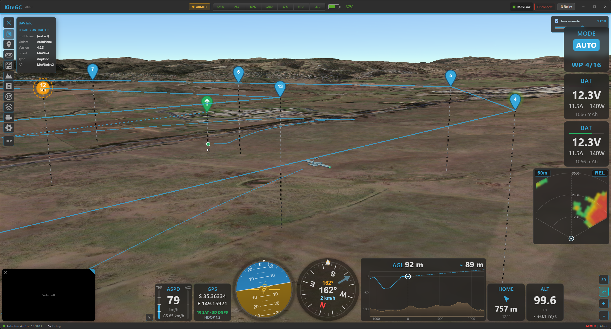
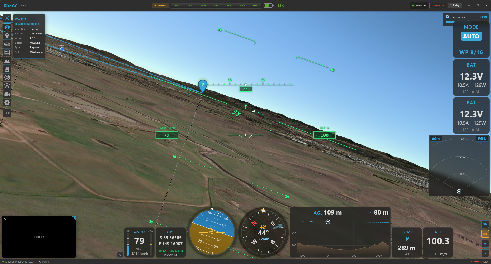

# 3D map

Kite has a full **3D globe** view, built on CesiumJS, alongside the flat 2D map. It drapes real-world
**terrain** and map imagery over the globe and renders the **same data you see in 2D** — the flight
track, the mission, the aircraft, and every overlay (radar, geozones, safe homes, airspace) — in three
dimensions, with several camera modes including a first-person cockpit view.

## Switching between 2D and 3D

Use the **2D / 3D** button in the map's corner controls to switch views. Your position and zoom carry
across, so you stay looking at the same place. Everything that's on the 2D map appears in 3D and
vice-versa; the difference is purely how it's drawn.

/// caption
The 3D globe: real terrain, the altitude-coloured flight track with its curtain to the ground, and the
mission overlay.
///

## Real-world terrain & imagery

3D terrain comes from **Cesium World Terrain**, which needs a **free Cesium Ion token**. Kite prompts you
for one the first time you open 3D; paste it once (or add it later in **Settings → Data**) and the globe
shows true elevation. Without a token the 3D view still works — you just don't get real-world terrain
relief. The surface **imagery** is whatever map/tile provider you've chosen for the 2D map, draped over
the terrain.

!!! warning "3D needs an internet connection"
    The terrain mesh is streamed live from Cesium and is **not** cached for offline use — this is a
    design limitation. In the field without a connection, the 2D map (whose tiles *are* cached) is the
    offline-capable view. See the [offline notes](../troubleshooting/connection.md).

## The flight track in 3D

The track is drawn at its true altitude and **colour-coded**, exactly as in 2D — but how you colour it
depends on whether you're flying or reviewing:

- **Live** — the growing **trail** is always coloured by **flight mode** (there's no choice; it tracks
  the mode as it changes).
- **Replay** — the track-colour dropdown in the player lets you colour the whole track by **flight
  mode**, **altitude**, **speed** or **signal**.

To make height legible the track gets:

- a clean line with a dark **outline**,
- a translucent **ground shadow** draped on the terrain directly below it, and
- an **altitude curtain** — a vertical wall from the track down to the ground (toggle it in **Settings →
  Interface → Map → Altitude Curtain (3D)**).

The track uses the aircraft's smooth fused-altitude source, so it doesn't stair-step. The live trail
grows behind the aircraft (with a thin ground-clamped trail shown before arming).

## The mission in 3D

A loaded mission renders **just like 2D** — the same coloured route lines and the same waypoint icons
(shown as fixed-size markers that always face you) — plus a **drop-line** from each waypoint straight
down to the ground so you can read its height over the terrain. In replay, the **MISSION** toggle in the
player shows/hides it.

## Camera modes

The **camera** button in the corner cycles through four modes (the icon shows the current one):

- **Free** — fully manual: drag to rotate, right-drag/scroll to pan, tilt and zoom anywhere.
- **Follow** (chase) — the camera rides **behind** the aircraft and follows its heading. **Scroll** to
  change the chase distance; **drag vertically** to change the chase pitch. Motion is smoothed.
- **Orbit** — locks onto the aircraft and lets you **orbit** around it freely.
- **FPV** (cockpit) — the view sits **at the aircraft, looking along the flight direction**, with no
  model in the way and stabilised motion. A **HUD** overlays attitude (artificial horizon, pitch/roll),
  heading, speed and altitude, plus a **flight-path marker**. **Scroll** to change the field of view (the
  FPV "zoom").

/// caption
FPV mode: an onboard view along the flight path with an attitude/heading/speed HUD and flight-path marker.
///

## The aircraft in 3D

The aircraft is a **3D model** chosen for its type, oriented to its real **attitude** (pitch, roll, yaw)
and motion-smoothed so it moves cleanly. In replay it flies along the recorded track; live it follows
telemetry in real time. The same models are used for the chase/orbit views and are hidden in FPV.

## Everything else, in 3D too

The 3D map mirrors the rest of Kite's overlays, each placed at real altitude:

- **Radar contacts** — 3D models coloured by relative altitude, with drop-lines and ground footprints
  for near-level traffic. See **[Radar & ADS-B](radar-and-adsb.md)**.
- **Geozones / geofence / rally points** — zones as extruded volumes between their altitude limits. See
  **[Safety](safety.md)**.
- **Safe home & autoland** — the guard rings and the autoland approach drawn as a real descent profile.
  See **[Safety](safety.md)**.
- **Airspace & obstacles** — airspaces and obstacles from the Airspace Manager as 3D volumes/markers.

## Settings worth knowing

In **Settings → Interface → Map**:

- **Altitude Curtain (3D)** — the vertical wall under the track (above).
- **Real Daytime and Lighting (3D)** — light the globe with the real sun position (day/night, shadows).
- **Log Replay Time (3D)** — during replay, drive that lighting from the log's actual time of day, so a
  dusk flight looks like dusk.
- **3D Power Saving** — cap the 3D frame rate to save battery: **Off (60 fps)**, **On (20 fps)** or
  **Auto** (20 fps on battery). Helpful on laptops and tablets.

## Where to go next

- Colour the track and read the modes: **[Telemetry & display](telemetry-and-display.md)**.
- Preview a route's terrain clearance: **[Missions](missions.md)** and **[Safety](safety.md)**.
