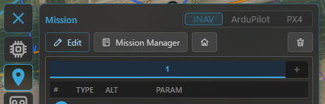
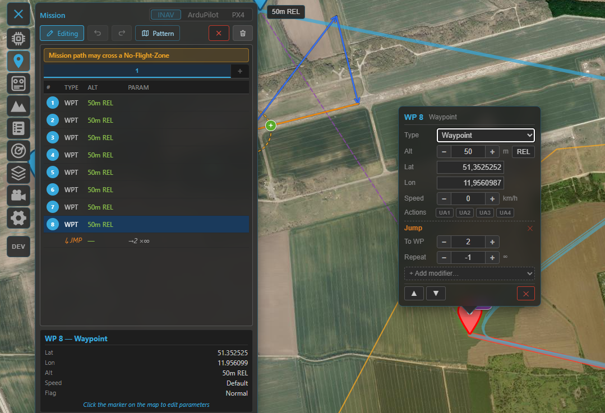
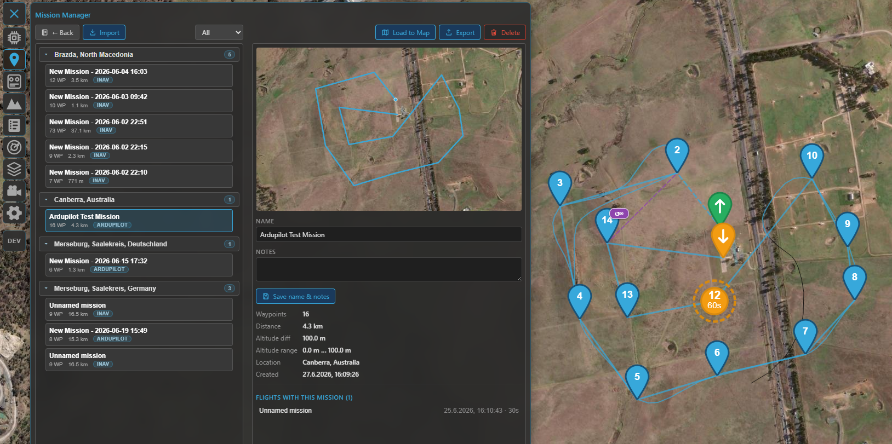

# Missions

Kite's mission planner lets you draw a flight plan on the map, send it to the aircraft, and read one
back. It speaks three flight stacks — **INAV**, **ArduPilot** and **PX4** — and adapts the editor,
the icons and the file format to whichever one is active. This guide covers the shared concepts and
where the three differ; it doesn't drill into every individual waypoint type.

Open the planner from the **Mission** tool on the navigation rail.

## Choosing the flight stack

The planner always targets one stack at a time:

- **Connected** — the stack is **locked** to the connected aircraft (INAV / ArduPilot / PX4), detected
  automatically. You can't switch it by hand while connected.
- **Offline** — pick the stack yourself with the INAV / ArduPilot / PX4 selector so you can plan before
  you fly. For **ArduPilot** there's also a **vehicle-type** dropdown (Plane / Copter / QuadPlane /
  Rover / Boat / Sub), which tunes the available commands and icons.

If you connect to a different stack while a plan is loaded, Kite asks before discarding it.

/// caption
Pick the flight stack (and, for ArduPilot, the vehicle type) when planning offline; it locks to the
connected aircraft once you're linked.
///

## The core idea: main waypoints vs modifiers

Whatever the stack, a mission is an ordered list of items that fall into two kinds:

- **Main waypoints** have a **position on the map** — fly here, hold here, land here.
- **Modifiers** have **no position of their own**. They change the sequence or behaviour at that point.

How each stack names them:

- **INAV** — main: *Waypoint*, *PosHold*, *Land*, *Set POI*; modifiers: *Jump* (loop back N times),
  *RTH* (return to home), *Set Heading*.
- **ArduPilot / PX4** — the items are MAVLink commands: the **navigation** commands (take-off, waypoint,
  loiter, land, RTL…) are the main steps, and **DO_ / CONDITION_** commands are the modifiers. Commands
  that don't apply to the selected vehicle type get a soft **⚠** warning — never blocked, just flagged.

The split is the same on all three, and it's what shapes the list and the map (below).

## How it's displayed

### In the waypoint list

- **Main waypoints** get a **numbered round badge** (1, 2, 3 …).
- **Modifiers** are shown **indented** under the point they follow. Their numbering depends on the
  stack: **INAV** leaves modifiers *unnumbered* (only main waypoints are counted), while **ArduPilot /
  PX4** number *every* item sequentially (modifiers included) — each matching how its flight controller
  counts mission items.
- A **Jump** is drawn as a repeat badge (**↺N**) linking back to its target.

### On the map

Waypoints appear as **numbered teardrop markers** joined by the route line, with type-specific icons
(loiter circles for holds, a take-off / land marker, a Set-POI/ROI eye, a home marker, and so on). The
numbers on the map match the list.

### Mission summary (footer)

Under the list a summary line shows the plan's **total distance** and **climb / descent**, plus — when
your waypoints set a cruise speed — an estimated **flight time**. (Without an explicit speed the time is
left out rather than guessed from an assumed cruise.) Next to it sit the waypoint count and the
provenance / **Modified** badges (below). This summary reads the same for INAV, ArduPilot and PX4.

### Numbering differs between stacks

This is the one difference worth remembering:

| Stack | Item 0 | Your waypoints |
|---|---|---|
| **INAV** | — | numbered **1 … N** (modifiers excluded from the count) |
| **ArduPilot** | **Home** — a fixed home slot, shown as a home marker, **not** an editable waypoint | start at **1** |
| **PX4** | no home slot — item 0 is already a real waypoint | numbered as the FC lists them |

So on an ArduPilot plan, "waypoint 1" is your first real point and the home item is managed for you (a
take-off is anchored on it). On PX4 there's no reserved home item at all.

## Altitudes

Each waypoint carries an altitude against a **reference**:

- **INAV** offers three modes: **REL** (relative to the home/launch point — the usual default), **AMSL**
  (absolute, above mean sea level) and **AGL** (above ground level / terrain-following). AGL is a
  **planning aid**: because INAV itself only stores REL/AMSL, Kite resolves each AGL point to an absolute
  altitude (using terrain elevation) when the mission is uploaded or exported.
- **ArduPilot / PX4** set a MAVLink **altitude frame** per item — **relative** (to home), **absolute**
  (AMSL) or **terrain** (terrain-following).

!!! tip "Check your clearance"
    The **Terrain** tool plots the ground beneath a planned route so you can sanity-check above-ground
    clearance before you fly. See it alongside the mission.

## Building a mission

- **Add** points by clicking on the map; **drag** a marker to move it; **reorder** in the list.
- **Edit** a point (type, altitude, parameters) from its popup or the list.
- **Multi-select**, **undo / redo** (**Ctrl+Z** / **Ctrl+Y**, or **Ctrl+Shift+Z** to redo), and
  **clear** are all available while editing.
- **Survey patterns** — generate an area scan (a back-and-forth grid over a drawn region) instead of
  placing every leg by hand.

/// caption
Building a mission: the numbered waypoint list (main waypoints with indented modifiers) and the route
on the map.
///

## Sending it to the aircraft

| Action | INAV | ArduPilot / PX4 |
|---|---|---|
| **Upload** (GCS → FC) | over MSP | over MAVLink |
| **Download** (FC → GCS) | over MSP | over MAVLink |
| **Save to FC permanently** | **EEPROM save / load** (survives a power cycle) | — (the FC keeps the uploaded mission) |

Up- and downloads show an **"x of n"** progress counter as the waypoints transfer.

After a download the plan is tagged **FC** (see provenance below); the mission you see is exactly what
the aircraft will fly.

## Files & the mission library

- **Save / load files** — INAV uses `.mission` (MultiWii XML); ArduPilot and PX4 use `.waypoints`
  (the QGroundControl-compatible plain-text format). You can also drag a file onto the map.
- **Provenance badges** tell you where the loaded plan came from — **FC** (downloaded), **FILE** (opened
  from disk) or **DB** (from the library) — plus a **Modified** badge once you've edited it. Shown for
  all three stacks.

### The mission library (Mission Manager)

Save a plan into Kite's **library** to reuse it across sessions, then open the **Mission Manager** to
browse them. Missions are grouped by **location** (named automatically from their coordinates) and can
be **searched**, **loaded to the map**, **exported** to a file, or **deleted** — with a warning when
flights still link to a mission you're removing. Saving **de-duplicates by content**, so re-saving an
unchanged plan won't pile up copies. The library is **shared across the flight stacks** (each mission
loads back into the stack it belongs to), and library missions also link to flights in the
**[logbook](logbook.md)**.

/// caption
The Mission Manager — your saved missions, grouped by location, ready to load to the map, export or delete.
///

## Multiple missions (INAV)

INAV lets you keep **several missions** (up to nine) and switch between them with the mission tabs —
handy for storing alternates. Uploading sends **all** of them to the flight controller as one combined
mission set (and **EEPROM save** stores the whole set); downloading reads it back and splits it into the
separate tabs again — so a multi-mission round-trips cleanly. ArduPilot and PX4 work with a **single**
mission.

## Staying clear of airspace

If the aircraft has **geozones** (INAV) or a **geofence** (ArduPilot / PX4) set, Kite can check your
plan against them and warn about waypoints that breach a no-fly area. See **[Safety](safety.md)**.

## Where to go next

- Watch the mission fly: **[Telemetry & display](telemetry-and-display.md)**.
- Keep clear of terrain and airspace: **[Safety](safety.md)**.
- 3D preview of the route: **[3D map](map-3d.md)**.
