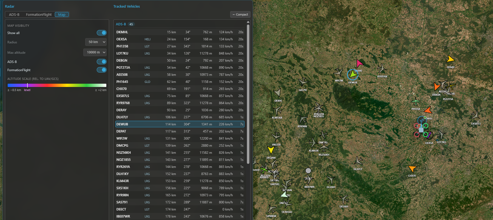
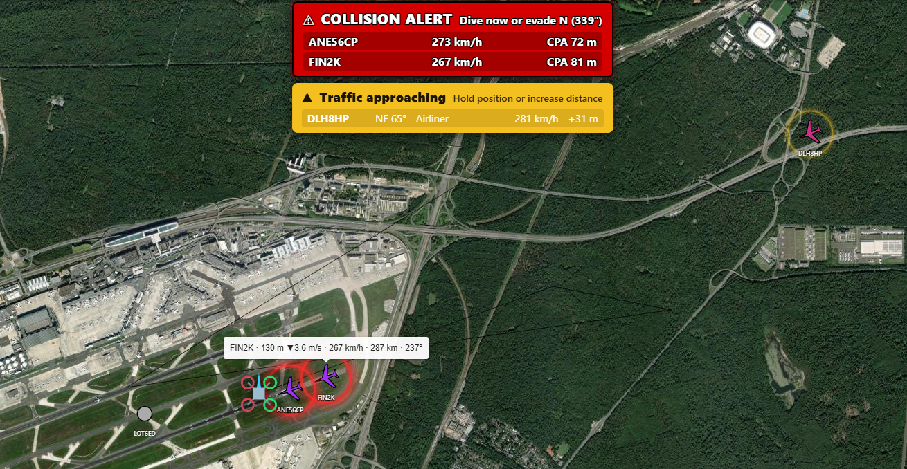

# Radar & ADS-B

Kite's **Radar** tracks *other* aircraft around you — manned traffic and fellow pilots — separately from
your own connected UAV. It pulls contacts from independent sources, shows them in a list and on the map
(2D and 3D), and can raise **collision alerts** when manned traffic closes on your aircraft.

It's deliberately isolated from your flight link: the radar runs on its own connections and never shares
the serial port the flight controller uses, so it can't disturb your telemetry.

!!! note "Not a real radar"
    The name is borrowed from the hobby (INAV-Radar / MWP). Kite doesn't transmit anything to detect
    aircraft — it *receives* position reports the aircraft (or a ground service) already broadcast.

## Turning it on

Radar is **off by default**. Enable it in **Settings → Data → Telemetry**:

1. Switch on the **Radar** master toggle — this reveals the **Radar** tool on the navigation rail.
2. Turn on the **systems** you want: **ADS-B** and/or **FormationFlight**. Each is independent; leave off
   what you don't use.

Then open the **Radar** tool. The panel has a tab per enabled system for **source configuration** on the
left, and the **tracked-vehicle list** (all systems, grouped) on the right, plus a **Map** tab for the
map-display controls. A **Compact** button collapses it to just the list.

/// caption
The Radar panel: the source configuration for the selected system on the left, all tracked vehicles
(grouped by system) on the right.
///

## ADS-B

ADS-B is the position broadcast that most manned aircraft transmit. Kite can collect it from **three**
kinds of feed at once and merges them into **one ADS-B list** (de-duplicated by the aircraft's ICAO
address, so the same plane seen by two feeds appears once):

- **Online services** — public ADS-B aggregators over the internet. Two are **built-in** (adsb.lol and
  adsb.fi — just toggle them on). You can **add more** as custom rows (name + URL template + optional API
  key); **adsb.one** comes **pre-filled as an example** custom row (it's there for convenience but left
  off by default, as that service has had server-side reliability issues). Set the **download radius**
  (10–100 km) and the **poll interval** (2–30 s) under **Online service**. Online feeds are fetched
  **around the area you're looking at** — the 2D map centre or the 3D camera focus — so panning the map
  moves the query. No hardware needed.
- **Local receiver** — a USB ADS-B receiver (e.g. ADSBee, PicoADSB) that streams **MAVLink
  `ADSB_VEHICLE` (message #246)**. Add a receiver row under **Local sources**, pick its **serial port**
  and **baud**, and Kite reads the traffic directly — fully offline. Kite accepts **both MAVLink v1 and
  v2** automatically (it detects the frame version itself — there's no setting to match), so just point
  the receiver at the port. (Network / Wi-Fi receivers are coming.)
- **From your UAV** — on **INAV 8.0+**, if your aircraft has its own ADS-B receiver, Kite can download
  its traffic list over the existing flight link (the **UAV Source** toggle). This appears only when the
  connected FC supports it; ArduPilot and PX4 don't offer this path.

### Reading the ADS-B tab

Top to bottom, the ADS-B tab is organized into:

- **Alerts** — the collision-alert toggles and thresholds (see [Collision alerts](#collision-alerts)).
- **Online service** — the **download radius** and **poll interval** that apply to all online feeds.
- **Online sources** — the provider rows: the two built-ins plus any custom rows, with **Add source**.
- **Local sources** — your hardware receivers, with **Add receiver**.

Every source row has its own **on/off toggle** and a **status badge** — a green number is the live
contact count from that feed, a red ✕ means it errored — so you can mute a feed without deleting it. An
**enabled** row collapses to a single line (name · count · toggle); a **disabled** row expands to show
its fields (URL / API key for online, port / baud for a receiver) and a **delete** button. New rows
start disabled so you can fill them in first. A serial port already used by another source is shown as
*in use* in the other pickers.

!!! tip "Online ADS-B needs internet"
    The online services need connectivity. In the field with no connection, a **local receiver** or the
    **UAV source** keep working.

## FormationFlight

**FormationFlight** (the open-source ESP32 mesh radar, formerly INAV-Radar) lets a group of pilots see
each other. Each aircraft carries an ESP32 module that broadcasts its position over its radio and relays
the peers it hears. Connect a **receiver module** to Kite over **serial** (on the FormationFlight tab:
pick the port, set a **node name**).

To join the mesh, Kite presents itself to the module as an INAV flight controller located at your **GCS
position**, so the module shares your location with the formation and relays the other peers back to you.
Peers appear as **letters (A–F)** with their position, heading, speed and a **link-quality** indicator
(0–4); a peer that goes silent is marked **lost** and kept at its last position for a while.

FormationFlight contacts are for **monitoring and pilot-to-pilot awareness only** — they never raise
collision alerts (those are ADS-B only, below).

For the module firmware and hardware, see the
[FormationFlight project](https://github.com/FormationFlight/FormationFlight).

## The tracked-vehicle list

The right side lists **every** contact, grouped **ADS-B → FormationFlight**, each on one row. Columns are
tailored per system (ADS-B carries altitude, ground speed, a vertical trend and an aircraft-type
abbreviation; FormationFlight carries the relative altitude and link quality).

- **Distance and bearing** are measured from your **connected UAV** (when it has a GPS fix), otherwise
  from your **GCS location**.
- Contacts **fade with age** and drop off after their time-out.
- Selecting a row highlights that contact on the map (and vice-versa).

## On the map

Contacts render on both the 2D and 3D maps in their own layer, oriented to heading, with the callsign as
a label (full readout on hover / when selected). Configure the display from the panel's **Map** tab.

**Colour means altitude — relative to you, not distance.** The scale is centred on *your* level (the
UAV's altitude with a fix, else the ground at your GCS):

- **violet** = right at your level (highest danger),
- warming through **red → yellow → green → white** as a contact climbs above you,
- **blue** for anything below you.

A legend in the Map tab shows the scale. In **3D**, near-level contacts also get a drop-line to the
ground and a footprint circle so you can judge where they are.

Map controls (Map tab):

- **Show all** — ignore the relevance filters and draw everything.
- **Radius** — contacts beyond it are dimmed and shrunk (never hidden).
- **Max altitude** — a hard ceiling that hides high airliners from the map as clutter (they stay in the
  list); anything descending toward your level is shown regardless.
- **Per-system visibility** — show/hide ADS-B or FormationFlight on the map independently of tracking
  them.

/// caption
Traffic on the map: silhouettes coloured by altitude relative to you, with the legend and the 3D
drop-lines for near-level contacts.
///

## Collision alerts

For **ADS-B traffic only**, Kite can warn you when a contact threatens your **connected UAV** (it needs a
valid GPS fix on your aircraft; without one, alerts are off). There are two stages, each toggled in the
ADS-B tab's **Alerts** group:

- **Stage 1 — Caution** — a contact is within the **warn radius** and the **distance is decreasing**.
  Cheap and always available; shown yellow.
- **Stage 2 — Collision warning** — Kite predicts the **closest point of approach** from both 3D tracks
  (course + climb/sink) and warns if the predicted miss is too small within the look-ahead window. Shown
  red, with a suggested evasion.

Alerts surface as a **banner** along the top of the map (listing every affected contact, click a row to
select it), an **audible** tone and an optional **spoken** callout (in your UI language), and a **pulsing
highlight** on the contact on both maps. Sound and voice have separate switches, and the numeric
thresholds (warn radius, vertical separation, CPA miss distances and look-ahead) are **adjustable** in
the same group.

/// caption
A collision alert: the banner over the map and the pulsing highlight on the conflicting contact.
///

!!! warning "An aid, not separation"
    These alerts help you spot converging traffic — they are **not** an anti-collision system and don't
    command your aircraft. Keep visual watch and follow your local rules.

## Where to go next

- Aeronautical airspace, airports and obstacles live in the neighbouring **Airspace Manager**: see
  **[Safety](safety.md)**.
- See contacts in 3D: **[3D map](map-3d.md)**.
