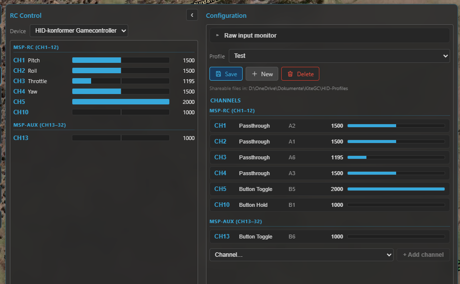

# RC control

Kite can fly the aircraft from the ground station using a **USB joystick, gamepad or RC transmitter** (in
USB / joystick mode): it reads your controller, maps the axes and buttons to RC channels, and streams
them to the flight controller over the live link. This is a **safety-critical** feature — it's off until
you explicitly **take control**, and it's deliberately gated behind a deadman so a frozen or disconnected
GCS can never keep stale sticks flying.

!!! danger "This commands the aircraft"
    RC control sends real stick inputs to a real vehicle. Understand your FC's RC and failsafe
    configuration first, test on the bench, and keep a way to recover (a physical transmitter, or the
    FC's failsafe). Kite adds guards, but **you** are flying.

Open it from the **RC** tool on the navigation rail. It's available once you enable RC control in
**Settings**, and is hidden on passive-telemetry links (there's no uplink to send on).

## The big picture: three very different systems

How the GCS injects RC depends entirely on the flight stack — these are **not** the same mechanism:

| Stack | How it's sent | Channel model |
|---|---|---|
| **INAV** | MSP `SET_RAW_RC` (stick stream) + latched `AUX_RC` | per-channel µs, up to 32 channels |
| **ArduPilot** | MAVLink `RC_CHANNELS_OVERRIDE` | per-channel µs, 16 channels (Primary 1–8 / Secondary 9–16) |
| **PX4** | MAVLink `MANUAL_CONTROL` | **4 normalised axes** + aux + buttons (not per-channel) |

The **controller-side** half — reading your device, mapping, profiles, the engage gate — is identical for
all three. Only the part that talks to the FC differs. Each stack's specifics are below.

## Setting up your controller

The controller half works the same regardless of the stack:

- **Device** — pick your controller from the **Device** dropdown. Kite reads the **raw** device (all
  axes, buttons and hat switches), so HOTAS sticks, throttles and transmitters in joystick mode work, not
  just Xbox-style gamepads. A small centre deadband is applied so a resting stick can't leak a command.
- **Raw input monitor** — a collapsible view of every live axis / button / hat, so you can see what your
  controller reports.
- **Platform** — when **offline**, a **Platform** selector (INAV / ArduPilot / PX4) next to the Device
  lets you build a profile for a chosen stack. When connected, the platform is **locked** to the detected
  flight controller.

/// caption
The RC panel: the device and live input monitor, the per-channel mapping, and the Take-control engage
button.
///

### Channel mapping

Each RC channel is driven by a **method** fed from your controller's inputs (axes **A**, buttons **B**,
hat directions **H**). Use **Learn** to bind an input by just moving/pressing it. The methods:

| Method | Inputs | What it does |
|---|---|---|
| **Axis Passthrough** | 1 axis | direct stick → channel (invert, deadband) |
| **Axis Analog Adjust** | 1 axis | the axis sets a *rate of change* (e.g. throttle, gimbal) |
| **Axis Dual Source** | 2 axes | one adds, one subtracts (absolute or adjust) |
| **Button Hold** | 1 button | high while held, low released |
| **Button Toggle** | 1 button | cycle 2–6 positions (optional hold-to-toggle, anti-accidental) |
| **Button Step** | 2 buttons | discrete +/− steps |
| **Button Adjust** | 2 buttons | ramp +/− while held |
| **Button Set** | up to 6 buttons | each button latches the channel to its own fixed value |

Expo is left to the firmware. Each channel can have a display name shown in the live monitor.

### Profiles

Mappings are saved as **shareable profile files** (in `Documents/KiteGC/HID-Profiles/`), not buried in
settings — **Save**, **New** and **Delete** from the profile dropdown. A profile is never auto-linked to a
device or FC; you pick the active profile yourself, so you stay in control of what's mapped.

## Taking control (and the safety net)

Control is **never** automatic. Streaming starts only when you **long-press "Take control"** and stops on
**"Release control"**. Until then the panel just shows a **mapping preview** — nothing is sent.

- **Deadman** — the GCS continuously heartbeats the latest frame; if it stops (controller unplugged, UI
  frozen, link dropped, or you release control) Kite **stops streaming immediately** and never repeats the
  last sticks. The FC then does whatever its failsafe is configured to do.
- **Seed on connect** — when you engage, Kite seeds each **button-driven** and **adjust** channel from
  the FC's current values so they don't jump. **Passthrough (direct-axis) channels are *not* seeded** — a
  stick that isn't physically centred can still jump to its real position the moment you take control, so
  centre your sticks before engaging.
- **Armed-disengage confirmation** — releasing control while the vehicle is **armed** pops a confirmation,
  because handing flying back to an FC with no other receiver triggers its failsafe (RTL / land / disarm).
- **RC rate** — the stick stream rate is selectable (10–25 Hz). On **INAV**, Kite runs a quick
  **link-speed test** a couple of seconds after you engage and warns if the link can't keep up at the
  chosen rate (suggesting a lower RC or telemetry rate). This test is **INAV/MSP only** — there's no
  equivalent check on the MAVLink (ArduPilot / PX4) path.

## INAV (MSP)

INAV uses two MSP primitives:

- **`SET_RAW_RC`** — the streamed **stick** frame (channels 1–16). It's *fire-and-forget* and fails safe:
  if the stream stops, the FC reverts to its RC / failsafe.
- **`AUX_RC`** — **latched** AUX switches (channels 17–32). A value set here **persists** on the FC until
  you change it; there's **no failsafe** under it, which is why Kite keeps critical switches off it.

### Version differences (important)

| INAV version | What you get |
|---|---|
| **Below 8.0** | **No RC over MSP** — Kite blocks it (older firmware always replies, wasting the downlink). |
| **8.0 – 9.0** | **Stick streaming** via `SET_RAW_RC` (channels 1–16). |
| **9.1 and up** | Adds **latched AUX** via `AUX_RC` (channels 17–32) on top. |

### Will the sticks actually take over?

Whether your GCS **sticks** (CH1–16) reach the aircraft depends on how the FC's receiver is set up. There
are two situations:

**A normal receiver is fitted** (you also fly with a regular RC link). Your stick stream only takes over
while the FC's **`MSP RC OVERRIDE`** mode is **active**:

- Activate it with a switch on your transmitter, or by mapping it to an **AUX channel** you control from
  the GCS.
- While it's **off**, the panel shows *"Override inactive — AUX only"* and only your AUX channels (CH17+)
  do anything. While it's **on**, it shows *"MSP RC OVERRIDE active — controlling CH1–16"*.
- On top of that, the FC keeps an **override bitmask** — a list of which channels MSP is even *allowed* to
  override. Kite compares it with your mapped channels and, if some wouldn't be overridden, offers a
  one-click **Set override bitmask** (applied **at runtime only**, not saved to the FC).

**The receiver is set to MSP, with no other radio** (a direct serial or internet link). There's no
physical receiver to defer to, so the GCS *is* the receiver and takes over fully — no override switch
needed.

In **either** case, **AUX channels (CH17+) always work** — latched AUX never collides with the stick
stream, so you can drive modes/switches from the GCS even when the sticks aren't engaged (this is also how
you'd map an AUX switch to turn `MSP RC OVERRIDE` itself on).

!!! warning "Don't share the stick channels with another MSP-RC system"
    INAV **cannot tell who an MSP RC command comes from**. If something else already feeds RC to the FC
    over MSP — for example an **mLRS** link running in MSP-RC mode — do **not** also drive the main
    channels (CH1–16) from Kite: the two streams collide and the FC can't separate them. In that setup,
    use **AUX channels (CH17+) only** from the GCS.

Kite also reads the FC's **mode ranges** and labels each AUX channel with the mode it drives (e.g. *CH5 →
ANGLE*), and runs **safety checks** on the AUX channels you control: a critical mode (ARM / RTH /
FAILSAFE) on a latching AUX channel is **blocked** (if the link dropped, a latched switch could leave you
unable to disarm or recover), and autonomous GPS modes (CRUISE / WP / POSHOLD / ALTHOLD) raise a
**warning**.

## ArduPilot (MAVLink)

ArduPilot uses **`RC_CHANNELS_OVERRIDE`** — one message carrying channels **1–16**, grouped in the panel
as **Primary (CH1–8)** and **Secondary (CH9–16)** (the two halves use different "release" encodings, which
Kite handles for you).

- **No override-mode switch** — overrides take effect as soon as you engage, so the **manual Take-control
  gate is the primary guard** here.
- **FC-side deadman** — ArduPilot's `RC_OVERRIDE_TIME` (≈3 s by default) reverts to the real RX if the
  stream stops. Kite's own deadman is the front-line stop; the FC timeout is the backstop.
- **No forced release on disengage** — when you release control Kite simply *stops* sending (rather than
  sending a "release" frame), leaving the FC a few-second window to re-engage before its failsafe fires.
- **`SYSID_MYGCS`** — ArduPilot only accepts overrides from its configured GCS system ID; a mismatch
  silently drops them.
- **Modes and arming** go through the **Control** tool (`DO_SET_MODE` / arm), not the override stream —
  though you can map a flight-mode channel if you prefer.

## PX4 (MAVLink)

PX4 is fundamentally different: it uses **`MANUAL_CONTROL`**, which is **not** per-channel PWM but
**four normalised axes** (roll, pitch, throttle, yaw) plus up to **6 aux axes** and **32 buttons**. Kite
gives PX4 its own **manual-control editor** rather than the channel grid.

- **Throttle is centred** — stick centre = mid throttle (PX4 maps it [−1, 1] → [0, 1] for both
  multirotor and fixed-wing).
- **Buttons** are sent as a bitfield; **PX4 maps each button to an action** per vehicle (in PX4 / QGC), so
  there's nothing button-related to configure on the Kite side.
- **`COM_RC_IN_MODE`** must allow a MAVLink/joystick source (not "RC only") or PX4 ignores the input —
  Kite shows a reminder.
- **Modes and arming** stay on the Control tool.

!!! note "PX4 support is newer"
    The PX4 manual-control path is more recent and less field-tested than the INAV and ArduPilot paths.
    Verify behaviour carefully (bench first) before relying on it.

## Where to go next

- Command modes, arm/disarm and guided flight: the **Control** tool (ArduPilot / PX4).
- Set up the link first: **[Connecting](connecting.md)**.
