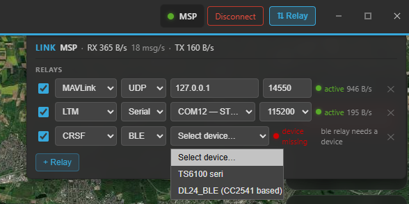

# Relay & forwarding

The **Telemetry Relay** taps the live telemetry already flowing into Kite, **re-encodes** it into another
wire protocol, and pushes it out a **second** link. That turns Kite into a telemetry transcoder — feed an
antenna tracker, a phone app, a second ground station, or convert one protocol into another — all from the
data your aircraft is already sending.

It works with **any** input: whether your aircraft is connected over MSP (INAV), MAVLink (ArduPilot /
PX4) or the passive Telemetry mode, the relay sees the same decoded telemetry and can output it in any of
the supported protocols.

!!! note "What the relay is — and isn't"
    - **Live only** — it forwards the active connection's telemetry; it does **not** forward log replay.
    - **One-way** — it only pushes telemetry *out*. It never sends commands back to the aircraft.
    - **A transcoder, not a pass-through** — everything is decoded to Kite's internal model and
      re-encoded, so it can convert between protocols. Fields Kite doesn't model are dropped.

## Opening the panel

Click **⇅ Relay** at the right of the connection bar (always visible). A panel drops down with:

- **LINK** — diagnostics for your primary connection: the active protocol and the live RX / TX byte rate
  (and messages/s), so you can confirm data is coming in.
- **Relays** — your configured relays, each one row. Add one with **+ Relay**; remove it with the ✕.

/// caption
The Relay panel under the connection bar: the LINK diagnostics on top and a configured relay row below
(protocol, output, status).
///

## A relay row

Each relay is configured like a mini connection bar:

1. **Enable** (the checkbox) — keep the config but pause it when off.
2. **Protocol** — what to encode the telemetry *as*: **LTM**, **MAVLink**, **CRSF** or **SmartPort**.
3. **Output** — where to send it:
   - **Serial** — a second COM port + baud (also covers Bluetooth-SPP adapters like an HC-05).
   - **BLE** — a Bluetooth Low Energy device Kite writes to.
   - **TCP** — Kite acts as a **server**: it opens a **listen port** and the consumer (app / GCS)
     connects *to Kite's IP*.
   - **UDP** — Kite **sends** to a **host / IP + port** you enter (can be a broadcast address).
4. **Status dot** — **idle** (not connected), **active** (green, with the output byte rate), **waiting**
   (amber — e.g. a TCP relay with no client connected yet), **device missing** (the output port/device
   isn't available), or **error**.

!!! tip "The output must be a separate link"
    A relay has to use a **different** device than your primary connection — you can't relay back out the
    same serial port the aircraft is on. Pick another COM port, a BLE device, or a network target.

You can run **several relays at once** (e.g. LTM to a tracker *and* MAVLink to a tablet). Relay configs
are **saved** between sessions and **auto-start** with your primary connection whenever their output
device is available — there's no separate Start button.

## Usage examples

### Feed an antenna tracker (LTM over serial)

An LTM antenna tracker (e.g. U360GTS) wants LTM on a serial link:

1. **+ Relay** → protocol **LTM**.
2. Output **Serial** → pick the tracker's COM port (an HC-05 / Bluetooth-SPP adapter shows up as a COM
   port too) and its **baud**.
3. **Enable** it. Once your aircraft is connected, the dot goes **active** and the tracker starts
   following.

### Watch on a phone / tablet (MAVLink over UDP)

Stream to QGroundControl or Mission Planner on another device on the same network:

1. **+ Relay** → protocol **MAVLink**.
2. Output **UDP** → enter the device's **IP** and port (the MAVLink default is **14550**).
3. Point the app at *UDP in* on that port. The aircraft now shows up there — even if your aircraft talks
   MSP, because the relay re-encodes it as MAVLink.

### Let an app connect to Kite (over TCP)

When you'd rather have the consumer dial in:

1. **+ Relay** → your protocol → output **TCP** → set a **listen port**.
2. In the app, connect to **Kite's IP : that port** (Kite is the server). Good for an LTM tool like
   *mwptools* or a MAVLink GCS that prefers TCP.

### Convert between protocols

Because everything is decoded and re-encoded, the input and output protocols are independent. For
example: an **ArduPilot (MAVLink)** aircraft → **LTM** out for an LTM-only tracker; or a passive **CRSF**
link in → **MAVLink** out for a MAVLink ground station.

## Good to know

- **TCP**: Kite is the server (consumer connects to Kite). **UDP**: Kite is the sender (you give it the
  target IP/port). Listen ports must be unique — Kite bumps a duplicate to the next free port for you.
- The relay emits a complete frame set paced to the incoming telemetry rate (typically a few Hz), so the
  output cadence follows your link.
- **Flight-mode / vehicle-type naming** in the MAVLink, CRSF and SmartPort outputs is best-effort — the
  position, attitude, GPS, battery and basic status are the reliable fields. LTM over serial/TCP is the
  most validated path.

## Where to go next

- Set up the incoming link first: **[Connecting](connecting.md)**.
- What the telemetry contains: **[Telemetry & display](telemetry-and-display.md)**.
