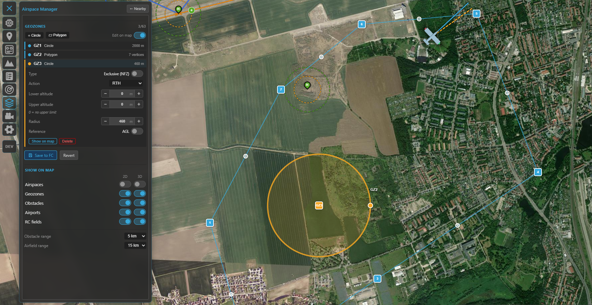
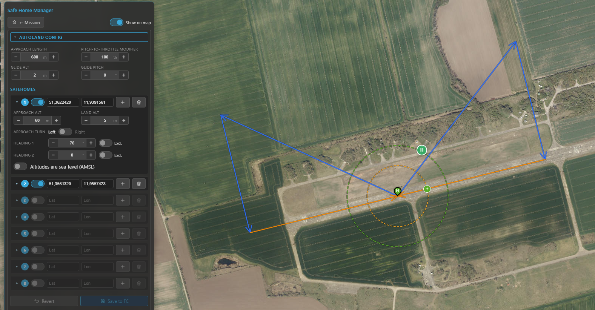
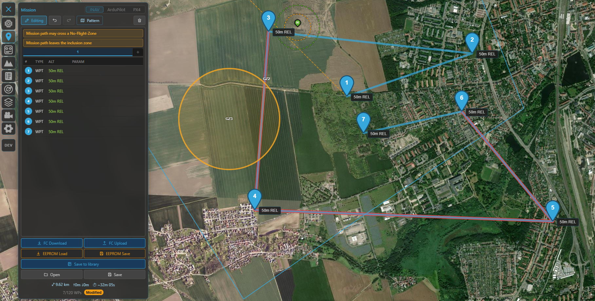

# Safety

Kite groups the features that keep an aircraft out of trouble — **terrain clearance**, **no-fly /
keep-in areas**, and **automatic landing / return** — into one place in this guide. Most of them are
*editors* for settings that live on the flight controller itself: Kite reads them, lets you change them
on the map, and writes them back. The FC does the actual enforcing in flight.

Which tools you get depends on the connected stack, because the three firmwares model safety quite
differently:

| Capability | INAV | ArduPilot / PX4 |
|---|---|---|
| Keep-in / keep-out areas | **Geozones** (per-zone altitude band + action) | **Geofence** (geometry only; one global action) |
| Divert / return locations | (uses safe homes) | **Rally points** |
| Automatic landing | **Safe Home + fixed-wing autoland** (per-site editor) | via flight mode (Land / RTL) |
| Terrain clearance preview | ✓ | ✓ |
| Plan-vs-airspace check | ✓ | ✓ |

The rest of this page walks through each.

---

## Terrain clearance

Before any of the airspace tools, the simplest safety check is **"will I hit the ground?"** The
**Terrain** tool (navigation rail) plots the elevation of the ground beneath a route or a flown track
so you can sanity-check your above-ground clearance.

- **Waypoints mode** profiles your *planned* mission; **Track** mode profiles a live or loaded flight.
- It draws your **flight path** against the sampled **terrain**, with a **clearance floor** line; any
  stretch that drops **below the floor** is highlighted.
- It reports **min clearance**, **max climb** and distance, in **MSL** or **AGL**.

/// caption
The Terrain tool: your route (or track) plotted over the ground beneath it, with the clearance floor and
any below-clearance stretches flagged.
///

!!! note "Needs elevation data"
    Terrain sampling needs the online terrain source; out of coverage or fully offline it reports
    *terrain data unavailable*. This is a planning aid — it does not command the aircraft.

---

## Keep-in & keep-out areas

Both firmware families let you define areas the aircraft should stay inside (**inclusion / flight
zones**) or out of (**exclusion / no-fly zones**). Kite edits them on the map and uploads them, but the
two models differ enough to be worth understanding.

Throughout Kite, the colours are consistent: **inclusion = blue**, **exclusion = amber**.

### INAV — Geozones

Geozones are INAV's onboard airspace fences (firmware **8.0+**). Edit them from the **Airspace** tool;
they show as the **Geozones** layer (toggle it in the panel, default on — and they're always shown while
you're editing a mission).

What a geozone carries:

- **Shape** — **circle** or **polygon**.
- **Type** — **Inclusive** (flight zone, keep in) or **Exclusive** (no-fly zone, keep out).
- **Altitude band** — a per-zone **lower** and **upper** altitude (upper `0` = no limit), referenced to
  **AGL** (above launch) or **AMSL**.
- **Breach action** — what the FC does at the boundary: **None**, **Avoid**, **Position hold** or
  **RTH**. The map even reflects the action in the line: dashed/thin for *None*, solid for *Avoid*,
  solid-thick for *Position hold / RTH*, with a translucent fill on enforcing zones.

In flight INAV enforces these itself — it steers around no-fly zones autonomously in self-levelling
modes and even **plans an RTH path that avoids them**. Up to **63 zones** (sharing a pool of 126
vertices) fit on the FC.

/// caption
Geozones in the Airspace Manager: the zone list (type, altitude band, action) and the blue inclusion /
amber exclusion areas on the map.
///

Editing is **map-first**, just like the mission planner: add a circle or polygon, drag its handles,
click an edge to insert a vertex, or type exact coordinates in the popup. The panel sets the type,
altitude band, reference and action. Editing is **locked while armed**.

**Saving** writes every zone to the FC, stores it to EEPROM and **reboots** the flight controller —
geozones only take effect after a restart, so the link drops and reconnects. Kite checks your zones
first (valid shapes, vertex/zone limits, sensible altitude band) and fixes polygon winding for you.

### ArduPilot / PX4 — Geofence

ArduPilot and PX4 expose a geofence over MAVLink. Edit it from the same **Airspace** tool (**Geofence**
layer). The geometry concept is the same — **inclusion / exclusion** × **polygon / circle**, plus an
optional **return point** (ArduPilot) — and the on-map editing reuses the geozone UX exactly (drag
handles, vertex insert, coordinate popup, armed-lock).

The difference is in the model: on ArduPilot/PX4 the **altitude limits and the breach action are not
part of each zone** — they're a single set of **global parameters** that apply to the whole fence. Kite
reads and writes the core ones in the panel's **Fence parameters** block, choosing the right names for
the connected autopilot:

- **ArduPilot** — fence **enable**, **breach action**, **max altitude**, **home radius** (and min
  altitude / margin).
- **PX4** — fence **action**, **max horizontal** and **max vertical** distance.

Saving uploads the fence and writes the changed parameters; no reboot is needed.

!!! tip "Two ways to express the same idea"
    INAV carries each zone's **altitude band** and **breach action** with the zone itself, so different
    areas can have different ceilings and reactions — a finer-grained model than the single global action
    ArduPilot and PX4 apply across the whole fence. If you fly both, plan around that: on the MAVLink
    side a fence is *geometry plus one global rule*.

### Rally points (ArduPilot / PX4)

ArduPilot and PX4 also support **rally points** — alternate return/divert locations the FC can use
instead of home (e.g. for RTL). Kite edits them on the same **Airspace** panel: green **R** markers you
drag on the map, each with a lat/lon and altitude, plus the rally parameters (use limit, include home).
They load on connect and upload on save. INAV has no separate rally concept — it returns to home or to a
**safe home** (below).

---

## Automatic landing — Safe Home & Autoland (INAV)

This is an INAV-only system, and one of its more sophisticated ones. A **safe home** is a stored
landing site (lat/lon); for fixed wings, INAV (**7.1+**) can fly a complete **wind-aware automatic
landing** there on RTH — loiter, downwind, base, final, glide and flare. Kite gives you the editor for
both. (On ArduPilot and PX4 it works differently: multirotors and VTOLs land automatically on a Land /
RTL command, while fixed wings autoland only as part of a preloaded mission — so there's no separate
per-site landing editor like this one.)

Open it from the **Mission** tool: the INAV mission panel has a **home** button that opens the **Safe
Home Manager**.

- **Display** works on any connected INAV — safe homes and their guard rings are downloaded on every
  connect and drawn on the map.
- **Editing + autoland configuration** needs **INAV 7.1+** (validated through 9.1; newer shows a hint).

/// caption
The Safe Home Manager: the collapsible autoland configuration on top and the eight safe-home slots
below, each with its own approach settings.
///

### The safe-home slots

Up to **eight** slots. Each holds a **position** (set it by dragging on the map, typing coordinates, or
**Set here** to drop it at the map centre) and, when autoland is available, a per-site **approach**:

- **Approach / land altitude** — the pattern entry height and the touchdown height.
- **Approach turn** — left or right circuit.
- **Heading 1 / 2** — the allowed landing directions. Each can be **bidirectional** (the opposite
  heading is allowed too) or marked **exclusive** (that direction only); `0` disables it. INAV picks the
  one most into wind.
- **Sea-level reference** — interpret this site's altitudes as **AMSL** instead of relative; toggling it
  re-converts the values using the terrain elevation at the point.

A per-slot **Clear** empties a slot. Use the toolbar's **Show on map** toggle to hide/show the overlay.

### The autoland configuration

The collapsible **Autoland Config** box holds the global approach parameters: **approach length**,
**pitch-to-throttle modifier**, **glide altitude / pitch**, and — only if the aircraft has a
**rangefinder** — **flare altitude / pitch** (no rangefinder, no flare phase).

### On the map

For each enabled safe home Kite draws:

- the **safe-home marker** (a green/grey "H" teardrop),
- a **green max-distance ring** (the `safehome_max_distance` guard) — shown **only while disarmed**,
- a **yellow loiter ring** at the approach altitude, and
- the **approach path** itself, drawn as a real descent in 3D: level downwind, a ~⅓ step-down on base,
  then a linear final to the ground at the touchdown point (blue downwind/base, orange final).

This renders on **both** the 2D and 3D maps.

### Saving

Edits build up in a working copy — nothing is live until you press **Save to FC**, which writes the
whole package (safe homes + approaches + autoland settings) to the FC and saves it to EEPROM in one go.
**Revert** drops your unsaved changes.

---

## Plan-vs-airspace check

When you have geozones (INAV) or a geofence (ArduPilot/PX4) set, Kite checks your **planned mission**
against them automatically and flags trouble — these are **hints, never a blocker**:

- A warning bar above the waypoint list (e.g. *launch/home is inside a no-fly zone*, *mission path may
  cross a no-fly zone*, *mission path leaves the inclusion zone*).
- The **offending legs are drawn red** on both the 2D and 3D maps.

The check is **altitude-aware**: a leg that passes *over* a zone's ceiling, or *under* an exclusion
zone, isn't flagged. Inclusion zones are only enforced when your launch/home actually sits inside one
(matching how INAV behaves).

/// caption
The plan-vs-airspace check: a warning bar and red legs where the route would breach a zone.
///

!!! warning "These are previews, not the last word"
    Kite's checks help you catch mistakes before you fly, but the flight controller is what actually
    enforces fences, geozones and landings. Always confirm the configuration on the FC and test
    conservatively.

## Where to go next

- Plan a route that respects all this: **[Missions](missions.md)**.
- See the approach and zones in 3D: **[3D map](map-3d.md)**.
- Aeronautical airspace (airports, obstacles) lives in the same panel: **[Radar & ADS-B](radar-and-adsb.md)**.
