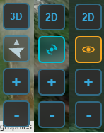
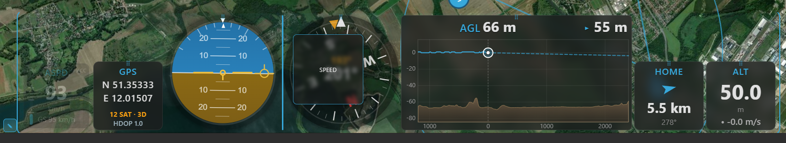
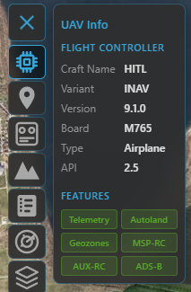

# Telemetry & display

Once you're [connected](connecting.md), Kite turns the link into a live cockpit: a moving map behind a
set of flight instruments, with the aircraft's status along the top. This guide explains what every
part shows and how to arrange it to your liking.

Everything here works the same way on a **live** link and during **[log replay](logbook.md)** — the
widgets and map are driven by the same telemetry stream either way.

## The moving map

The map fills the whole background and is always interactive — pan and zoom even with a panel open.
It draws, in real time:

- **Your aircraft** — an icon at the current position, rotated to its heading.
- **The flown track** — a trail behind the aircraft.
- **Home** — the home/launch point once the flight controller sets it.
- **The mission** — any loaded or downloaded waypoints (see **[Missions](missions.md)**).

### Direction indicators

At the aircraft, Kite can draw short **direction lines**: the **heading** (where the nose points),
the **course over ground** (where it's actually travelling — the two differ in wind), and a
**predicted-turn** arc. Toggle them with **Direction indicators** in **[Settings](../reference/settings.md)**
(on by default).

### Map controls

A small cluster of buttons sits in one corner of the map:

- **2D / 3D** — switch between the flat moving map and the full 3D globe. The button shows the mode
  you'll switch *to*. The 3D view has its own controls — see the **[3D map guide](map-3d.md)**.
- **Follow mode** — cycles **Free → Follow → Heading-up**: free panning, keep the aircraft centred, or
  centre *and* rotate the map to the aircraft's heading.
- **Zoom + / −** — the mouse wheel works too.

/// caption
The map controls — the 2D/3D, follow-mode and zoom buttons (shown here in several states).
///

## Aircraft status (top bar)

The centre of the top bar is a live health summary of the connected craft:

- **Arming indicator** — whether the aircraft is **ARMED** or **DISARMED**.
- **Sensor-health tiles** — gyro, accelerometer, mag, baro, GPS, and rangefinder / airspeed when
  fitted. **Green** = OK, **amber** = warning, **red** = fault. Tiles only appear for sensors your
  craft actually reports, so the row adapts to the airframe.
- **Battery** — the primary pack's voltage and charge. See the **Battery** widget below for the full
  read-out, and **[Batteries](batteries.md)** for the pack library.

The same arming state is repeated at the far right of the **status bar** (the thin strip along the very
bottom), alongside the connection dot, firmware variant, version and port.

## Widgets & the docks

Flight instruments live in two **docks**: the **right dock** down the side and the **bottom dock**
along the bottom. Each widget is self-contained and updates live.

### Arranging widgets

- **Choose which widgets appear** in **[Settings](../reference/settings.md)** — toggle each on or off.
- **Rearrange them**: click the **✎ (edit)** button by a dock to enter **edit mode**, then drag
  widgets to reorder them or move them between the two docks.
- Widgets scale to fit the dock, and your layout (including which dock each widget sits in) is
  **remembered between sessions**.

/// caption
Edit mode — drag widgets to reorder them or move them between the docks.
///

### The widgets

| Widget | What it shows |
|---|---|
| **AHI** (artificial horizon) | Pitch and roll against an artificial horizon, plus a flight-path-vector marker. |
| **Speed** | Airspeed when available (ground speed otherwise), with ground speed on a second line. A **throttle** bar (0–100 %) sits on the left and a derived **acceleration** bar on the right. |
| **Altitude** | The aircraft's barometric / navigation altitude (relative to home). |
| **Compass** | A rotating rose with the heading at the centre and a fixed top pointer. An amber **course-over-ground** bug rides the rim while moving — the gap to the nose is your **crab angle** — with the COG value read out above the heading. When wind is reported, a blue **wind arrow** (pointing downwind) and wind speed appear. |
| **GPS** | Latitude / longitude, satellite count, fix type (No fix / 2D / 3D / 3D DGPS) and HDOP. |
| **Home** | A large arrow pointing to home relative to the aircraft's heading, with distance and bearing. |
| **Battery** | The pack's voltage, current and **power (V × A)**, plus charge. On multi-battery aircraft (ArduPilot / PX4) it follows the highest-draw pack automatically, with manual pinning — see **[Batteries](batteries.md)**. |
| **Battery 2** | A second, independent battery widget so you can watch two packs at once. |
| **Flight Mode** | The current flight mode as a colour-coded badge (and waypoint progress during a mission). |
| **RC Link** | Link quality — shows whatever the active protocol provides (LQ, RSSI in % and dBm, SNR) and hides the rest. |
| **Raw Telemetry** | A compact numeric dump: altitude, speed, vario, heading, roll, pitch, voltage, current, mAh, satellites, RSSI and CPU load. |
| **Live AGL** | A forward-looking terrain-profile HUD: flown terrain on the left, **estimated** terrain ahead on the right, with a projected flight line that warns of a ground intersection. |
| **Terrain Radar** | A top-down, track-up terrain-awareness display (EGPWS-style): a forward fan coloured by clearance against your altitude, with a **range** and **REL / PRED** mode button. |
| **Video** | A live video feed embedded as a widget — an RTSP stream or a local capture device / camera (e.g. a USB capture card). See **[Video](video.md)**. |

!!! tip "Units are global"
    Speed, altitude, distance, vertical speed and temperature units come from **[Settings](../reference/settings.md)**
    and apply everywhere — every widget and map read-out follows them.

## How smooth it looks: telemetry rates

How often the instruments update depends on the **telemetry rates** in **[Settings](../reference/settings.md)**
— chiefly the **attitude** rate (drives AHI / compass responsiveness) and the **position** rate (map
movement, speed, altitude). Higher rates look smoother but use more link bandwidth; the defaults are
conservative so they're safe even on a slow over-the-air link.

On **MAVLink**, Kite normally requests only the messages it needs at those two rates and turns the rest
of the firmware's high-rate streams down, so a narrow telemetry radio isn't flooded. The **Full MAVLink
Telemetry** option turns that off: Kite hands rate control back to the **flight controller**, which then
streams whichever fields at whatever rates *it* is configured for. Use it on a fast link (USB, Wi-Fi,
high-bandwidth radio) or when you want a complete `.tlog` recording. (These rate requests are sticky on
the FC until it reboots.)

## UAV Info panel

The **UAV Info** tool on the navigation rail is a quick read-out of *what you're connected to*:

- **Flight controller** — craft name, firmware variant and version, board / target, vehicle type, the
  API version, and hardware revision when reported. Shown for any connection (INAV, ArduPilot, PX4).
- **Features** *(INAV)* — badges for the INAV capabilities Kite can use (autoland, geozones, MSP-RC,
  AUX-RC, ADS-B), lit when your INAV version supports them. These are version-dependent and INAV-specific,
  so the section appears only on an INAV link.

/// caption
The UAV Info panel on an INAV link — flight-controller identity and the version-gated feature badges.
///

## Where to go next

- Fly a planned route: **[Missions](missions.md)**.
- See it in 3D: **[3D map](map-3d.md)**.
- Review a recorded flight with the same instruments: **[Logbook](logbook.md)**.
