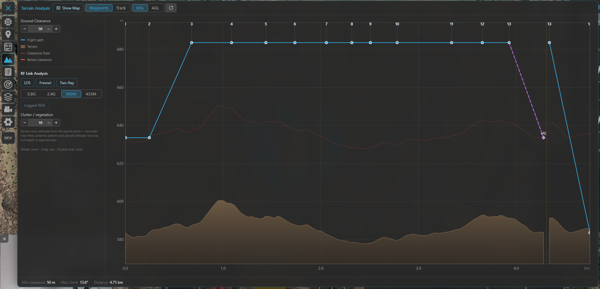

# Terrain & RF analysis

The **Terrain** tool plots the ground beneath your flight — your planned mission *or* a flown track —
so you can answer two questions before (or after) you fly:

- **Will I hit the ground?** — the vertical clearance of your path over the terrain.
- **Will my radio link hold?** — where hills (and trees/buildings) shadow the link to the GCS.

On top of the read-only profile it can also **correct waypoint altitudes** to hold a chosen ground
clearance, and **mirror the chart onto the map** so you can see exactly where a point on the profile is.

Open it from the **Terrain** tool on the navigation rail. It works for **INAV, ArduPilot and PX4**.

!!! note "Needs elevation data"
    Terrain sampling uses the online terrain source. Out of coverage or fully offline it reports
    *terrain data unavailable*. Everything here is a **planning / analysis aid** — it never commands the
    aircraft.

---

## The two view modes

A toggle in the header switches what the chart profiles:

- **Waypoints** — your *planned* mission. The profile follows the waypoint legs; markers show each
  waypoint, numbered exactly as the mission panel numbers them (on ArduPilot/PX4 the `DO_` items leave
  gaps in the numbering, e.g. 1, 2, 4, 5 …).
- **Track** — a *flown* flight: the live track while connected, or a loaded log / blackbox from the
  logbook.

A second toggle picks the **altitude datum**:

- **MSL** — absolute height above mean sea level. This view also draws the **RF loss field** (below).
- **AGL** — height above the ground directly below. This view draws the **line-of-sight clearance line**
  instead.

The **↻** button resets the zoom/pan. **Show Map** (header) shrinks the panel to a wide strip so the 2D
map stays visible beside the profile (see [Map view](#map-view-the-chart-on-the-map)).

---

## Reading the profile

/// caption
The profile: your path (blue) over the sampled terrain (brown), with the clearance floor and any
below-clearance stretch flagged.
///

The chart draws:

- **Flight path** (blue) — your mission/track altitude.
- **Terrain** (brown fill) — the sampled ground.
- **Clearance floor** (dashed) — terrain **+** your *Ground Clearance* target; any path stretch that
  drops **below** it is drawn as a red **below-clearance** segment.
- **Logged RSSI** (Track mode only, when present) — see [Track mode](#track-mode).

Below the chart the readouts show **Min clearance** (⚠ when it breaks the floor), **Max climb** angle and
**Distance**. Moving the cursor over the chart adds a live readout of **distance / terrain / altitude /
clearance** at that point — and a marker on the map.

**Zoom** with the wheel, **pan** by dragging, **double-click** to reset. The first and last waypoint sit
slightly inset from the edges so their numbers stay readable.

### Ground clearance

The **Ground Clearance** stepper sets the minimum above-ground height you want to keep. It drives the
clearance floor (and the below-clearance highlight), and is the target used by Terrain Correction.

---

## Terrain correction (Waypoints mode)

Beyond showing clearance, the tool can **adjust your waypoint altitudes** to hold the Ground Clearance
target — for all three flight stacks. Pick a mode:

- **Off** — display only.
- **Follow** — set every waypoint in range to the target above-ground height, then raise any leg that
  would still clip the terrain.
- **Check** — only **raise** waypoints that sit below the target; never lower them.

A **green dashed line** previews the corrected path. The panel reports **Changed** (how many waypoints
move) and the resulting **min clearance**. Tune it with:

- **Range (WP)** — limit the correction to a waypoint-number range. It defaults to the whole mission and
  stays that way unless you narrow it.
- **Fixed-wing** — additionally cap the **climb / descent angle**, raising the lower end of any leg that
  would be too steep for a fixed-wing aircraft.
- **➕ Add WP** — click the chart to drop a marker on the path (a pin appears on the map), then add a
  waypoint there — e.g. on top of a ridge — and re-run the correction so the path hugs the terrain more
  tightly.

Press **Apply** to write the new altitudes into the mission. Two honest limits are surfaced rather than
hidden:

- *"Climb-angle limit forces some waypoints above the target clearance"* — the fixed-wing angle cap won.
- *"A leg between fixed waypoints stays below clearance"* — that leg can't be cleared by moving one end
  (raise the fixed waypoint, widen the range, or add a waypoint).

!!! note "How the corrected altitude is stored"
    INAV stores corrected waypoints as **AGL** (resolved to an absolute height from the terrain at
    upload). ArduPilot / PX4 store them in the **terrain** frame — the aircraft follows them as intended
    only with terrain following / a terrain database enabled on the flight controller.

---

## RF link analysis (MSL view)

The RF section estimates where terrain **shadows the radio link** between the aircraft and the GCS,
sampling the ground radially from the launch point. Turn on one or more methods:

| Method | What it models |
|---|---|
| **LOS** | Pure geometric line-of-sight: is the straight path blocked by terrain? (naïve on/off) |
| **Fresnel** | Knife-edge **diffraction** loss (ITU-R P.526) — a realistic, continuous loss that also covers partial blockage. Supersedes LOS when both are on. |
| **Two-Ray** | Ground-reflection **multipath** — interference lobes and nulls (mostly at the low bands, over flat terrain, at long range). |

Pick the **band** your link uses — **5.8 GHz / 2.4 GHz / 900 MHz / 433 MHz** — since wavelength drives
both diffraction and reflection.

- In the **MSL** view the result is drawn as a **loss rainbow** behind the profile (green = clear →
  red = heavily attenuated) **and** as coloured **shadow wedges on the map**.
- In the **AGL** view only the **sightline-clearance line** is drawn (the rainbow is MSL-only — a note
  reminds you).

Extra controls:

- **Clutter / vegetation** — a height added to the bare terrain for the obstacle analysis (forest, small
  buildings). It tapers to zero at both endpoints (you launch from a clearing; the aircraft is airborne),
  so only clutter in the path interior blocks.
- **Logged RSSI** — overlay the link strength actually recorded along a flown track (Track mode; enabled
  only when the track carries RSSI), to compare the model against reality.

The origin (GCS antenna) is the **launch point** / FC home / ArduPilot takeoff waypoint in Waypoints
mode, and the **first fix** in Track mode. In Waypoints mode with none of those set, a hint asks you to
anchor it (a wrong origin would give misleading shadows).

!!! warning "What the estimate is — and isn't"
    This is a **terrain-only** estimate from the launch point. It **excludes** near-field effects,
    antenna pattern and aircraft attitude, and the two-ray null *depth* is approximate (the lobe
    *positions* are the trustworthy part). Treat it as a planning aid, not a link budget.

---

## Track mode

Track mode profiles a **flown** flight instead of a plan:

- **Live** — while connected, the current flight's track streams in and the profile extends in real time.
  A **Follow** toggle keeps the view pinned to the latest fix.
- **Loaded** — open a flight from the **[logbook](logbook.md)** (or a blackbox/log) to analyse it after
  the fact.

If the track carries **logged signal strength**, the **Logged RSSI** line plots it along the route, and
(in the RF section) you can compare it against the modelled link.

---

## Map view: the chart on the map

**Show Map** switches the panel to a wide strip so the **2D map stays visible** next to the profile. This
ties the two together:

- **Hover** the chart → a dot tracks the matching point on the map.
- **Click** the chart → a **pin** drops on the map at that point (it stays put even after you close the
  panel) — the same pin used by **Add WP**.
- With RF analysis on, the **shadow wedges** are drawn on the map where the link is degraded, pointing out
  from the launch origin.

So you can read "this dip in clearance / this radio shadow is *there* on the ground" at a glance.

---

## Where to go next

- Keep clear of airspace too: **[Safety](safety.md)**.
- Plan the route first: **[Missions](missions.md)**.
- Review a flown flight: **[Logbook](logbook.md)**.
