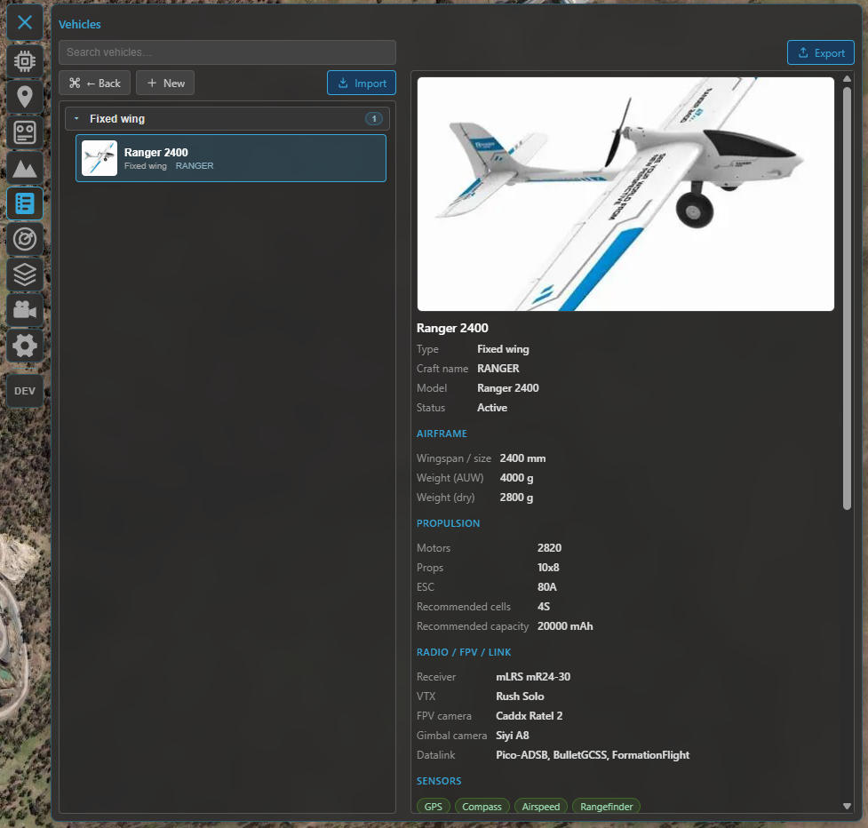
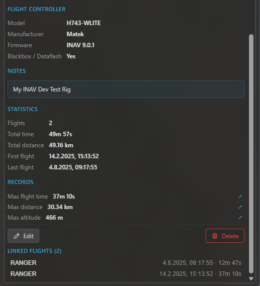

# Vehicles

The vehicle library is a catalogue of your aircraft — a structured **build sheet** for each one, plus
its flight history. Flights soft-link to a vehicle by **craft name**, so the library fills itself in as
you fly. It's a subfeature of the **[logbook](logbook.md)**: open it with the **Vehicles** button in the
logbook toolbar.

## The vehicle list

Vehicles are grouped by **type** and can be **searched** (by name, craft name, model, type, notes or
flight controller). Pick one to open its build sheet; the toolbar also creates a new vehicle and
imports one from a file.

/// caption
The vehicle library — your aircraft grouped by type, with search and per-vehicle build sheets.
///

## The build sheet

Each vehicle is a structured record you can fill in as much (or as little) as you like:

- **Identity** — name, **craft name** (the link key — see below), **type** (fixed-wing, flying-wing,
  VTOL, multirotor, helicopter, rover, boat, other) and **status** (active, storage, retired, damaged,
  **crashed**), plus a header **image** and free-form notes.
- **Airframe** — model, wingspan, length, all-up weight and dry weight.
- **Propulsion** — motors, propellers, ESC, and a recommended battery (cells / capacity).
- **Radio, FPV & datalink** — receiver, video transmitter, camera, gimbal camera, datalink.
- **Sensors** — checkboxes for GPS, RTK, compass, airspeed, rangefinder and optical-flow.
- **Flight controller** — model, manufacturer, firmware and version, and whether blackbox is available.

/// caption
A build sheet: image header, structured specs, lifetime stats and the flights linked to this aircraft.
///

## Linking flights

A flight links to a vehicle by **craft name** (the name already recorded with each flight — so it works
retroactively, no re-import needed):

- **INAV** supplies the craft name automatically, so flights link on their own.
- **ArduPilot / PX4** don't carry one in telemetry — set it on the flight (post-flight or later in the
  logbook) to link it.

Each vehicle then shows its **lifetime totals** (flight count, time, distance) and the **list of linked
flights**, jump-to-able from the build sheet.

## INAV extras

When an **INAV** flight controller is connected (and disarmed):

- **Write to FC** — push the build sheet's craft name to the FC, so its future flights auto-link to this
  vehicle.
- **Adopt FC lifetime stats** — read the FC's onboard `stats` totals (if the feature is enabled) and
  stage them as the vehicle's **lifetime baseline**; saved, they're added to the logbook flights so the
  totals reflect the airframe's whole life, including flights from before you used Kite.

## Import & export

Move a vehicle between installs (or back it up) with a **`.kvehicle`** file — export the open vehicle, or
import one (with a preview before it's added). The lifetime baseline travels with the file.

## Where to go next

- Where vehicles link from: **[Flight logbook](logbook.md)**.
- The other logbook library: **[Batteries](batteries.md)**.
