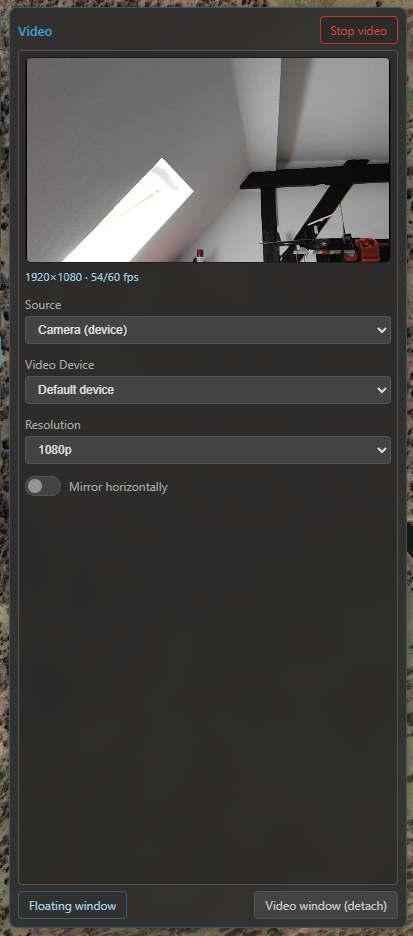
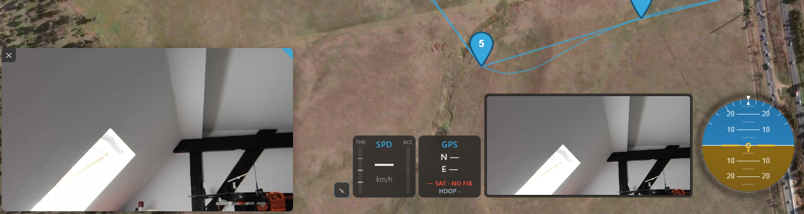
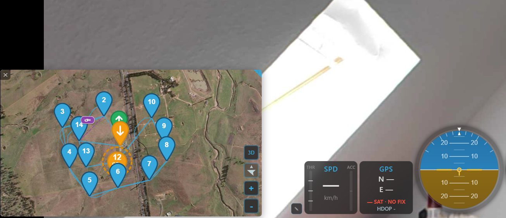

# Video

Kite can show a live video feed alongside (or behind) the map — an **RTSP stream** from an FPV/video
link, or a **local capture device** such as a webcam or USB capture card. Open it from the **Video** tool
on the navigation rail.

## Setting up a source

Pick the **source kind** and start it:

- **Camera** — choose a local capture device from the dropdown (webcams and capture cards are listed
  automatically).
- **RTSP** — enter the stream URL (e.g. from your video receiver or an RTSP server).

You can set the **resolution** (auto / 720p / 1080p) and **mirror** the image horizontally (handy for
front-facing cameras), then **Start** / **Stop** the feed. Your source choice is remembered between
sessions.

/// caption
The Video panel — source kind, device / RTSP URL, resolution and mirror, with Start/Stop.
///

!!! note "RTSP helpers download themselves"
    RTSP playback uses a small bundled engine (**go2rtc**), with **ffmpeg** as a fallback reader for
    streams it can't read natively. Kite downloads whichever it needs **automatically** the first time
    you start an RTSP source — no manual install. Local cameras need nothing extra.

## Where the video shows

The same feed can appear in several places at once (they all share one stream):

- **In the panel** — a preview right in the Video panel.
- **As a widget** — the **Video** widget in a dock, sized to the stream's aspect ratio.
- **In a floating window** — a movable video frame over the map. **Drag the video body** to move it;
  dragging it to the **bottom-left corner snaps it there**, where it **displaces the bottom widget dock**
  to make room (the dock shrinks by the window's size). Drag it away from the corner to un-snap and
  free-float. The **top-right corner grip resizes** it (aspect-locked, touch-friendly).
- **In a detached window** — a separate, free-floating **OS window** you can place anywhere, including
  **outside the app** or on a second monitor. Opened from the Video panel; because it lives outside the
  app it's closed from the OS (not from inside Kite), and — unlike the floating window — it **can't host
  the map** (no swap).

/// caption
The floating video window (over the map) and the dockable Video widget — both showing the same feed.
///

## Map ↔ video swap

**Double-click a video surface** (the Video widget or the floating window) to **swap it with the map**:
the map jumps *into* the surface you clicked and the video moves out to the full-screen background — so
you get **video as your main view with the map in the small frame**. Double-click again to send the map
back to the full-screen background.

How interactive the swapped-in **mini-map** is depends on where it landed:

- **In the widget** — deliberately limited by space: **2D only** and **heading-follow only**, but you
  **can zoom**.
- **In the floating window** — fully interactive: pan and zoom normally (left-drag / single-touch). To
  **move the floating frame itself** while it holds the map, drag with the **right mouse button**
  (desktop) or **two fingers** (touchscreen).

/// caption
Swapped: the live video fills the background while the map rides in the smaller frame.
///

## Where to go next

- Put the Video widget in a dock: **[Telemetry & display](telemetry-and-display.md)**.
- Trouble getting a stream? **[Video troubleshooting](../troubleshooting/video.md)**.
