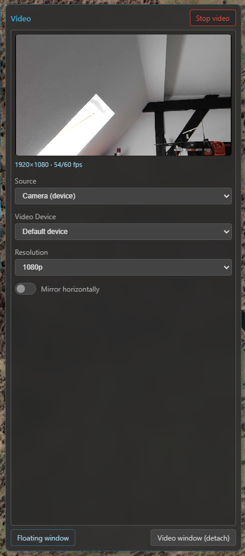
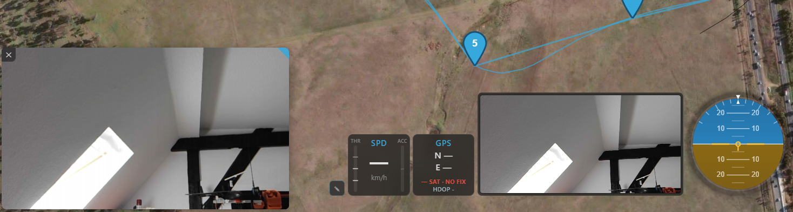
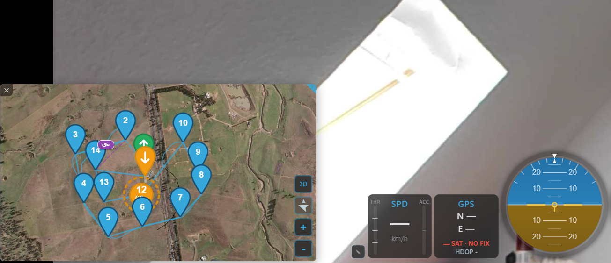

# Video

Kite can show a live video feed alongside (or behind) the map — a **local capture device** such as a
webcam or USB capture card, or an **RTSP stream** from a network video source. Open it from the
**Video** tool on the navigation rail.

## Choosing a source

Pick the **source kind** from the dropdown, set it up, then **Start** / **Stop** the feed. Your choice
is remembered between sessions.

- **Camera (device)** — a local capture device opened the simple way, through the system's built-in
  camera access. Choose a device from the dropdown (webcams and capture cards the system exposes are
  listed automatically). No extra downloads.
- **Native Capture (Advanced)** — a local capture device opened via Kite's capture engine for **more
  control and wider device support**. See the comparison below.
- **RTSP (network)** — enter the stream URL (e.g. from your video receiver or an RTSP server), pick a
  **transport**, and optionally **save the connection** to a list for one-click recall — see
  **[RTSP connections](#rtsp-connections-transport-and-auto-reconnect)** below.

!!! info "Supported RTSP video codecs"
    **H.264** and **MJPEG** are supported and tested everywhere. **H.264** is the usual choice;
    **MJPEG** costs more bandwidth but is passed through untouched — the lightest option wherever
    nothing should be converted (see the
    [platform notes](#platform-notes-what-to-expect-per-operating-system)).
    **HEVC/H.265** plays wherever the **Kite RTSP client** does the decoding: always on **Android**,
    and on **Windows**, **Linux** and **macOS** with the *Native RTSP client* toggle on (hardware
    decode; Windows additionally needs the free "HEVC Video Extensions" from the Microsoft Store).
    macOS is the one platform whose classic engine path plays HEVC as well.

    Other codecs — VP8, VP9, AV1 — are **not supported**. A stream Kite cannot play usually shows up
    as an endless *"Reconnecting…"* rather than a clear error. If you need one of them, please open a
    request: the limit is that we have no way to test it, not that it is impossible.

/// caption
The Video panel — source kind, device / RTSP URL, resolution, frame rate and mirror, with Start/Stop.
///

### Camera (device) vs Native Capture — which should I use?

Both play a local capture device; they differ in **how** they open it.

| | **Camera (device)** | **Native Capture (Advanced)** |
|---|---|---|
| Setup | Nothing to install | Needs the **ffmpeg** helper (downloaded automatically) |
| Device list | What the system exposes to apps | Read directly from the capture hardware — **can find devices the Camera list doesn't show** (e.g. some USB HDMI capture dongles) |
| Resolution / frame rate | A **request** — Auto / 720p / 1080p and an optional 30 / 60 fps wish; the camera picks the closest mode it supports | **Device-verified** — only the resolutions and frame rates your device actually reports (from a curated FPV set: SD PAL/NTSC, 480p, 720p, 1080p, 1440p) |
| Codec | Chosen automatically | Chosen automatically to hit the selected resolution/frame rate |

**Start with Camera (device).** Switch to **Native Capture (Advanced)** if your device isn't listed
under Camera, or when you want to pin an exact resolution / frame rate that the device confirms it
supports. Both deliver the same smooth, hardware-accelerated picture for devices the system can open;
Native additionally reaches devices that only the capture engine can see.

### Resolution, frame rate and mirror

- **Resolution** — Camera offers Auto / 480p / 720p / 1080p; Native offers the device-verified list.
- **Format** (Native only) — the capture format the device reports, e.g. MJPEG or a raw one. **MJPEG is
  the efficient choice**: the picture is passed straight through with no conversion at all.
- **Frame rate** — Camera offers Auto / 30 / 60 fps; Native offers the frame rates the device reports
  for the chosen resolution and format.
- **Mirror** — flip the image horizontally (handy for front-facing cameras). Applies to every place the
  feed is shown.
- **Disable hardware acceleration** — force the CPU for any stream conversion. Only needed if the
  picture is broken or unstable with hardware acceleration; the setting is remembered.

While a feed is live the panel names the pipeline underneath the picture, with two labels:
**Transcode** (`Copy` = nothing is converted · `Hardware` · `Software`) and **Surface** (how the
picture reaches the screen). `Copy` is the cheapest possible case.

### RTSP connections, transport and auto-reconnect

The RTSP source has a small **connection manager** built in:

- **Direct connect** — type the `rtsp://…` URL and press Start. Next to the URL sits the **transport**
  selector:
    - **Auto** (default) — lets the engine negotiate the transport, and falls back to an ffmpeg
      reader for the rare server that refuses every forced transport. Right for most sources.
    - **UDP** — lowest latency; **required for UDP-only servers** (some FPV / air-unit streamers).
    - **TCP** — for sources that only speak interleaved TCP, or when UDP is blocked by the network.
- **Save it** — the **💾 button** stores the current URL + transport as a named entry (named after the
  host; rename it via ✎). Connections are **only saved when you press the button** — never
  automatically.
- **The list** — each saved connection is a one-line entry: **click it to load and connect**, ✎ edits
  name / URL / transport inline, ✕ removes it. The entry matching the current URL is highlighted.
- **Smoothing buffer (frames)** — below the connection list. **0** (the default) plays with the lowest
  possible latency; each step up buffers **one frame time** more on the receiving side (at 60 fps:
  ~17 ms per step, derived automatically from the stream's actual frame rate). Raise it if playback
  looks uneven — duplicated or skipped single frames — on a jittery link such as cellular; every step
  costs exactly that much extra latency, so leave it at 0 when the picture is already smooth. The
  setting takes effect immediately on the running stream and is remembered.
- **Native RTSP client (experimental)** — Kite's own built-in stream client: no helper downloads,
  UDP-first connection with automatic TCP fallback, and native hardware H.264/HEVC decode on Windows,
  Linux and macOS (Android always uses it; there is no toggle there). Recommended on Linux — see the
  [platform notes](#platform-notes-what-to-expect-per-operating-system). If a particular source
  misbehaves with it, switch it off to fall back to the classic engine path.

**Auto-reconnect:** if a running RTSP feed drops or stalls — a radio hole on a cellular link, the
source restarting, a network change — Kite **reconnects automatically and keeps trying indefinitely**
until the feed returns or you stop it. While it retries, every video surface shows a
**"Reconnecting… (n)"** overlay with the attempt count and a **Stop** button. Brief dropouts on a live
feed are given a few seconds to heal on their own before a full reconnect is forced, so momentary
signal dips don't interrupt the stream unnecessarily.

!!! note "Helpers download themselves"
    **Camera (device)** needs nothing extra, and **RTSP with the Native RTSP client** toggle on needs
    no helper either (on Android that is always the case). **Native Capture** uses the bundled
    **ffmpeg** engine. Classic-path **RTSP** (toggle off) uses **MediaMTX** for the direct video path
    and **ffmpeg** for the image path — a machine whose browser engine offers no direct path (common
    on Linux) uses ffmpeg alone and never needs MediaMTX. Kite downloads whichever it needs
    **automatically** the first time you use that source — no manual install. On macOS ffmpeg is
    shipped with the app.

## Where the video shows

The same feed can appear in several places at once (they all share one stream):

- **As a widget** — the **Video** widget in a dock, sized to the stream's aspect ratio.
- **In a floating window** — a movable video frame over the map. **Drag the small square handle in its
  bottom-left corner** (the four-way arrow) to move it; dragging it to the **bottom-left screen corner
  snaps it there**, where it **displaces the bottom widget dock** to make room (the dock shrinks by the
  window's size). Drag it away from the corner to un-snap and free-float. The **top-right corner grip
  resizes** it (aspect-locked, touch-friendly).
  **On a phone** there is a **docked window** instead: fixed to the bottom-right of the map, sized to
  the stream (at most 40 % of the map height or half its width), no dragging or resizing. A **camera
  button** above the map buttons slides it off-screen to the right and back — it appears once a source
  runs and hides while the Video widget is active.
- **In a detached window** — the floating window taken **out of the app** into its own window, which
  you can put anywhere: beside Kite, or on a second monitor that then becomes your video screen. It
  **stays on top of other applications** and looks exactly like the frame inside the app.
  Hold the pointer over the floating window and an **unplug button** appears in its **top-left
  corner**; that takes the picture out. The detached window has no title bar — its buttons appear
  when the pointer is over it: **top-left brings the picture back into the app**, **bottom-right
  switches to fullscreen** on the screen it is on (or press `Esc`). Drag the picture to move it,
  the **top-right corner** resizes it, and the frame keeps the stream's aspect ratio.
  It **can't host the map** (double-click does nothing there), and where it stands — including
  fullscreen — is remembered: quit while detached and it comes back detached, on the same screen. If
  that screen is gone, it opens at a default size on Kite's own screen.
  Requires the **Native RTSP client** — on **Windows**, **macOS** and **Linux**; the
  [platform notes](#platform-notes-what-to-expect-per-operating-system) say what a Wayland desktop
  does differently.

/// caption
The floating video window (over the map) and the dockable Video widget — both showing the same feed.
///

## Map ↔ video swap

**Double-click a video surface** (the Video widget or the floating window) to **swap it with the map**:
the map jumps *into* the surface you clicked and the video moves out to the full-screen background — so
you get **video as your main view with the map in the small frame**. Double-click again to send the map
back to the full-screen background.

How interactive the swapped-in **mini-map** is depends on where it landed:

- **In the widget** — deliberately limited by space: **2D only** and **follow only** — a **tap** on
  the little map switches between **heading-up** and **north-up** (remembered), and you **can zoom**:
  mouse wheel or pinch, or **slide one finger up / down** on a touchscreen. Nothing else on it reacts
  (no waypoint placing or dragging, no context menu), and its markers are drawn at half size.
  Switching the mission editor on brings the map back to full screen automatically.
- **In the floating window** — fully interactive: pan, zoom, tilt and rotate exactly as on the big map
  (right-drag and two fingers reach the map). To **move the floating frame itself**, drag the **square
  handle in its bottom-left corner**, the same one as in video mode.
- **On a phone** (docked window or widget) — the widget's limits apply: 2D, follow, no panning. Tap
  the small map to switch heading-up / north-up, slide a finger up or down on it to zoom (or pinch).
  Double-tap swaps. With the video full-screen, the corner button becomes a **map button** that hides
  and shows the small map; double-tap the full-screen video to send the map back. Unobstructed
  fullscreen does not exist on the phone — the video fills the map area next to the widget column.

/// caption
Swapped: the live video fills the background while the map rides in the smaller frame.
///

### Unobstructed fullscreen

By default the swapped-in video fills the whole content area edge to edge — widgets, docks and the
nav rail float **on top of the picture**. If you prefer the picture fully visible, turn on
**Unobstructed fullscreen** in the Video panel (below *Rotate 180°*):

- The video becomes a **framed box** that keeps clear of the UI: the nav-rail column on the left is
  always kept free, and the right widget panel and the bottom widget dock are kept free **while they
  hold widgets**. An empty (or hidden) panel releases its edge, and the video grows into that space —
  as far as the stream's aspect ratio allows.
- The box is cut **exactly to the stream's aspect ratio**, so there are no letterbox bars.
- The area around the box shows a **softly blurred map** of the surroundings that follows your
  aircraft — the live UAV position when there is a GPS fix, the replayed model during a blackbox
  replay, or the ground-station location otherwise. With no position available the background stays
  plain.

The switch is remembered; turn it off to get the edge-to-edge fullscreen back.

## Platform notes: what to expect per operating system

Video is the one part of Kite that depends heavily on components Kite does **not** ship: the operating
system's built-in browser engine and its media plugins. That works out very differently per platform,
and it is only fair to say so plainly.

**Windows and macOS are the more predictable hosts for video.** Both ship a single, consistent media
stack, so a network stream is played directly by the system's hardware-accelerated decoder. If a smooth,
low-CPU, low-latency feed is important to you — and especially if you plan to fly with it — those are
the platforms we can most confidently recommend. For RTSP network streams, Linux joins them once
the **Native RTSP client** is switched on — see below.

**On macOS both RTSP routes are available.** The classic engine plays H.264 *and* HEVC directly (the
macOS browser engine is the only one that accepts HEVC on that path), and the **Native RTSP client**
toggle switches to Kite's own client: H.264 and HEVC are decoded by the system's VideoToolbox and
drawn straight into the video area — no helper programs, UDP-first with TCP fallback, mirror and
rotate live. Either route is fine; the native one skips the helper download and the local relay leg.
The detached video window works here too, and so does showing the picture in two places at once.

**On Linux, switch on the *Native RTSP client* for network streams.** With that toggle (Video panel →
RTSP section) Kite plays RTSP itself: **H.264 and HEVC go straight into the machine's hardware
decoder** — Intel/AMD graphics via VA-API, the Raspberry Pi 4's H.264 and the Pi 5's HEVC block via
V4L2, with an
automatic software fallback — and the picture is composited natively behind the interface instead of
being converted frame by frame. Measured on one laptop, a 720p60 HEVC stream plays at a stable 60 fps
for roughly a third of one CPU core where the classic path burned more than two cores and still could
not hold 50 fps. MJPEG sources are passed through untouched, as always. The client uses the
distribution's GStreamer plugins (the **.deb** installs them automatically; elsewhere:
`gstreamer1.0-plugins-base`, `…-good`, `…-bad`, `gstreamer1.0-gtk3` and `gstreamer1.0-libav`, or your
distro's equivalents) — if one is missing, Kite reports which GStreamer element it could not find.
Showing the picture in **two places at once** and the **detached video window** both work on this
route; the notes below say what each of them costs.

!!! note "Raspberry Pi 5 and HEVC"
    Encoders that pad the picture height to their block size — NVENC at 720p codes 736 rows, every
    1080p stream codes 1088 — declare the visible part in the stream header. The Pi 5's decoder path in
    GStreamer would copy every picture to apply that crop, which the zero-copy display cannot take.
    Kite instead lets the decoder deliver the full padded picture and hides the padding rows under the
    interface, so these streams stay zero-copy as well.

    The Pi 5's decoder also cannot paper over a lost picture: a picture whose reference never arrived
    stalls it, and the Pi's kernel driver then hangs until a reboot. Kite therefore holds the video
    after any lost packet until the next keyframe arrives — a short pause instead of a frozen decoder.
    A **short keyframe interval** at the encoder (1 s) keeps that pause short.

!!! warning "AppImage: video does not work there"
    The AppImage build cannot play video on either path — the AppImage's launcher environment hides
    the system's GStreamer plugins from every process inside it. Use the **.deb**, **.rpm** or the
    **portable build** instead; the AppImage is provided for a quick look at everything else and is
    planned to be retired.

**With the Native RTSP client off, video support is provided as-is.** Kite then runs video through
WebKitGTK, which hands playback to GStreamer — and which plugins your distribution installs is
entirely up to your distribution. There are hundreds of combinations of distro, desktop, graphics
driver and plugin set, and we cannot test or support them all. Concretely, these are things Kite
cannot fix from its side on that classic path:

- **Whether an RTSP stream can be played directly at all.** Many Linux systems — Raspberry Pi OS and
  current Debian desktops among them — run a browser engine that does not expose the direct (WebRTC)
  video path, and that cannot be installed after the fact. Kite then falls back to a **converted image
  stream**. It works, but it adds a conversion, so **expect noticeably more latency than on Windows or
  macOS** — this is the single biggest practical difference. If a smaller delay matters more than
  resolution, **send a smaller or slower stream from the source** (e.g. 480p instead of 720p, or 30
  instead of 60 fps): that saves work at every stage at once.
- **How much each frame costs to put on screen.** The image path decodes every frame for display, and
  the Linux engine is markedly slower at that than the Windows one — measured on one laptop, the same
  720×576 frame took about 13 ms against roughly 2 ms, and longer while the machine was busy. So a
  frame rate that is effortless on Windows can be out of reach on comparable Linux hardware, whatever
  the CPU says.
- **Whether that conversion uses your graphics hardware.** Kite tests your machine at start-up and uses
  the GPU for the conversion when it can — on Intel and AMD desktop graphics via VAAPI, and on
  Raspberry Pi 3/4 class boards via their built-in decoder. Where that works it is a large saving
  (measured on an Intel laptop: roughly a seventh of the CPU load). But it depends entirely on your
  driver stack: **NVIDIA cards are not specifically covered**, and any machine whose test fails simply
  converts on the CPU instead. The Video panel names the path in use, and the diagnostic log records
  the verdict (see **[Video troubleshooting](../troubleshooting/video.md)**).
- **A camera that already delivers MJPEG is the best case on Linux.** Nothing is converted at all —
  the picture is passed through unchanged, which costs almost nothing and gives the lowest delay
  Linux can offer. If latency is your priority on Linux, prefer an MJPEG source. The Video panel shows
  **Transcode: Copy** when this applies.
- **You can force the CPU path.** If hardware conversion misbehaves on your machine, switch on
  **Disable hardware acceleration** in the Video panel; the setting is remembered.
- **Local camera quirks.** On Linux the system camera layer can be slow or unresponsive on some setups.
  Kite works around the worst cases (it caps the automatic resolution and frame rate, and routes the
  advanced capture path around that layer entirely), but a camera the system itself can't open cleanly
  is out of reach.
- **The detached video window works, but it cannot stay on top of everything on Wayland.** Current
  desktops that run on Wayland — GNOME's default — do not let an application put its own window
  above other applications, so the detached window takes its turn in the normal stacking order
  there. Put it on a second monitor or beside Kite and it stays where you want it. The window also
  decodes the picture for itself (a window cannot borrow another window's hardware video surface),
  so it costs a second hardware decode of the same stream.
- **The picture in two places at once costs a conversion.** The second place is drawn by the
  processor rather than the graphics chip (two hardware-accelerated surfaces cannot share one
  pipeline), which on a desktop costs a few percent of one core for a widget-sized tile. All the
  in-app surfaces (widget, floating window, full-screen swap) work everywhere.

None of this means Linux is unusable — with the **Native RTSP client** it is a first-class platform
for network video, and a well-equipped desktop distribution generally plays the classic path fine
too. In short: **on Linux, try the Native RTSP client first for RTSP; an MJPEG source is the lightest
choice either way.**

**On Android, RTSP runs entirely through Kite's own built-in stream client** — there is nothing to
download and no engine choice: H.264 and HEVC are decoded by the device's hardware decoder, and MJPEG
streams are shown directly. (On iOS, RTSP is not available yet.)

- **Location updates pause during a Wi-Fi stream.** Every live location fix makes Android scan for
  Wi-Fi networks, and each scan takes the Wi-Fi radio off your network's channel for a moment — with
  an RTSP stream running over that same Wi-Fi, this shows up as a brief dropout roughly every ten
  seconds. Kite therefore pauses the **continuous** GCS-marker location mode automatically while an
  RTSP stream is playing over Wi-Fi: the GCS marker freezes at its last position and updates resume
  the moment the stream stops. Streams received over **mobile data** (or Ethernet) are not affected,
  and neither is a manually placed GCS marker. When Kite cannot tell which way the stream travels
  (some VPN setups), it pauses to be safe.

## Where to go next

- Put the Video widget in a dock: **[Telemetry & display](telemetry-and-display.md)**.
- Trouble getting a stream? **[Video troubleshooting](../troubleshooting/video.md)**.
