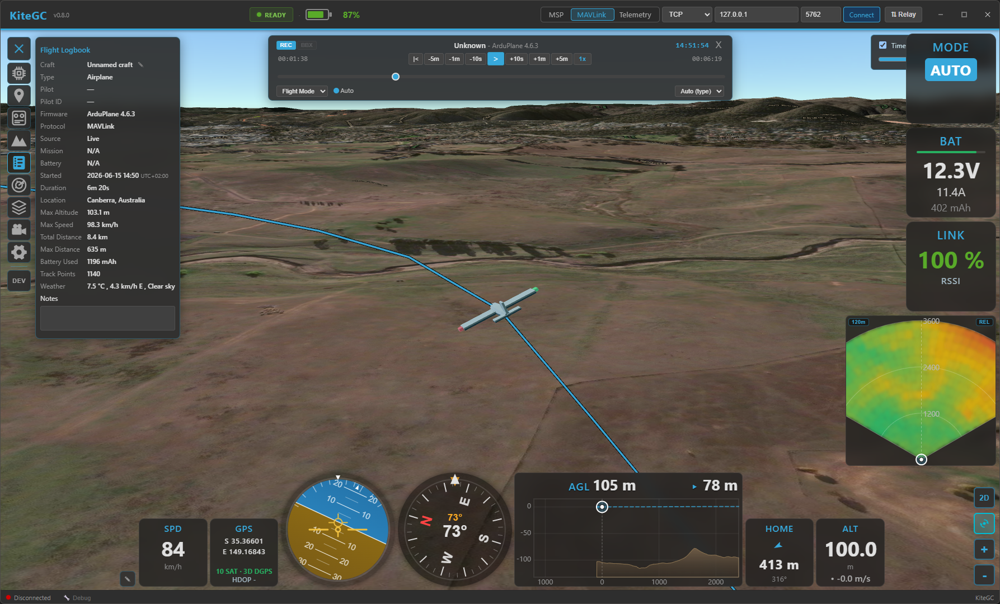

  { width="480" }
  { width="480" }

**Kite Ground Control (Kite GC)** is a modern, cross-platform ground control station for
**INAV**, **ArduPilot**, and **PX4** aircraft — planes, multirotors, VTOL, helicopters, rovers and
boats. It combines everything you expect from a GCS with a fast, intuitive interface and a few things
you won't find anywhere else — like a full 3D flight view, a fleet & battery manager, and live video
right next to the map.

/// caption
Kite Ground Control flying in 3D mode.
///

## Highlights

-   :material-cube-scan:{ .lg .middle } **Immersive 3D flight view**

    ---

    A full 3D globe with real terrain, your aircraft and track in 3D, a 3D mission overlay, an FPV
    cockpit camera, and real-time day/night lighting — switch between 2D and 3D seamlessly.

-   :material-quadcopter:{ .lg .middle } **One GCS for INAV, ArduPilot & PX4**

    ---

    Plan, fly, and log across all three autopilots with a consistent interface — including passive
    (listen-only) and relay link modes.

-   :material-warehouse:{ .lg .middle } **Fleet, Battery & Mission managers**

    ---

    Keep a library of your aircraft and batteries with full build sheets and lifetime stats, and a
    reusable mission library — all linked to your flight log.

-   :material-flash:{ .lg .middle } **Fast & intuitive**

    ---

    A performance-oriented interface with dockable widgets and panels that remembers your layout, so
    the focus stays on flying.

## Supported setups

- **Autopilots:** INAV (7.0+), ArduPilot, and PX4.
- **Aircraft:** fixed-wing, flying-wing, VTOL, multirotor, helicopter, rover, boat.
- **Connections:** USB / serial, Bluetooth (SPP & BLE), TCP, and UDP.
- **Link modes:** live control link, **passive** listen-only telemetry, or a **relay** that
  re-broadcasts to other ground stations.

## The essentials

Everything you'd expect from a ground station:

- **Live telemetry & HUD** — attitude, altitude, speed (incl. airspeed), a compass with wind and
  ground-track indicators, GPS/sensor health, link quality, and flight-mode display.
- **Customisable widget dashboard** — drag-and-drop flight widgets docked to the side and bottom.
- **2D moving map** — your aircraft, track, home and mission, with heading-up mode and day/night
  shading.
- **Mission planning** — create, upload, download and edit missions; undo/redo; survey-pattern
  generator; terrain-following / AGL waypoints.
- **[Vehicle control](guides/vehicle-control.md)** — arm/disarm, flight-mode changes, takeoff/RTL/loiter and more (ArduPilot/PX4).
- **Comfort** — a multi-language interface (English, German and French at launch; more to follow) and
  persistent window, layout and settings between sessions.

## What makes Kite special

- **Full 3D mode** — Cesium 3D globe with real terrain, a unified 3D mission overlay, an FPV cockpit
  camera with a conformal HUD, and live day/night lighting.
- **Terrain awareness** — AGL (above-ground) waypoints, a terrain-profile analysis for your mission,
  and live *terrain radar* / AGL widgets in flight.
- **Flight Logbook** — a full flight logbook no other GCS offers: automatic recording with replay,
  plus import of INAV blackbox, **ArduPilot Dataflash**, MAVLink `.tlog`, and **MWPTools-compatible
  raw-MSP** logs — unified into one searchable flight history.
- **Fleet (Vehicle) Manager** — a build sheet per aircraft (airframe, propulsion, FC, sensors, photo)
  with lifetime statistics and records, auto-linked to your flights; export/import as `.kvehicle`.
- **Battery Manager** — track each pack by serial: cycles, lifetime usage and health, with
  `.kbatt` export/import.
- **Mission Manager** — a searchable mission library shared across autopilots.
- **Safety suite** — geofences (ArduPilot/PX4), geozones (INAV), safe-home & fixed-wing autoland,
  airspace overlays (airports, controlled airspace, obstacles), and **foreign-vehicle radar** with
  ADS-B proximity & conflict alerts.
- **Live video** — low-latency RTSP video shown alongside (or behind) the map, with one-click
  map ⇄ video swapping.
- **Telemetry relay** — re-encode and forward live telemetry to other ground stations, handsets, or an
  antenna tracker.
- **RC control** — fly from the GCS with a gamepad/joystick (HID).
- **RF link analysis** — visualise signal quality to find the best antenna setup.

## Where to start

- New here? Begin with **[Installation](getting-started/installation.md)**, then your
  **[first connection](getting-started/first-connection.md)** and the
  **[quick tour](getting-started/quick-tour.md)**.
- Having trouble connecting? See **[Troubleshooting → Connection](troubleshooting/connection.md)**.

---

Kite GC is free, open-source software (GPL-3.0-or-later).
