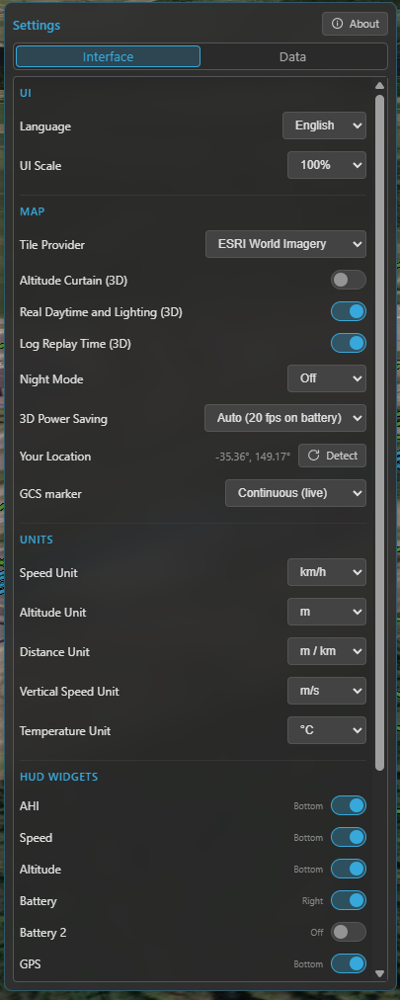

# Settings

A reference for every option in the **Settings** tool (navigation rail). Settings are split across two
tabs: **Interface** (how Kite looks and the units it uses) and **Data** (links, caches, logging and
alerts). Changes apply immediately and are remembered between sessions.

/// caption
The Settings panel — the Interface and Data tabs, each grouped into labelled sections.
///

## Interface tab

### User interface

| Setting | What it does | Default |
|---|---|---|
| **Language** | The UI language. | English |
| **UI scale** | Scale the whole interface — 100 %, 125 % or 150 % (for high-DPI or far-away screens). | 100 % |

### Map

| Setting | What it does | Default |
|---|---|---|
| **Tile Provider** | The map imagery source — used by **both the 2D map and the 3D globe**. | ESRI Hybrid |
| **Altitude Curtain (3D)** | Draw the vertical wall from the flight track down to the ground in 3D. See **[3D map](../guides/map-3d.md)**. | On |
| **Real Daytime and Lighting (3D)** | Light the 3D globe with the real sun position (day / night, shadows). | On |
| **Log Replay Time (3D)** | During replay, drive that lighting from the log's actual time of day (needs the option above). | On |
| **Night Mode** | Dim the 2D map at night — Off / Auto (by local time) / On. | Auto |
| **3D Power Saving** | Cap the 3D frame rate to save battery — Off (60 fps) / On (20 fps) / Auto (20 fps on battery). | Auto |
| **Your Location** | Your detected position (used as a fallback reference). **Detect** re-runs OS geolocation. | — |
| **GCS Location** | How the ground-station position is sourced — Off / Manual (set once) / Continuous (live). Used as the reference when no aircraft fix is available. | Continuous |

### Units

These are **global** — every widget, map read-out and panel follows them. See
**[Telemetry & display](../guides/telemetry-and-display.md)**.

| Setting | Options | Default |
|---|---|---|
| **Speed** | km/h · mph · m/s · ft/s · kt | km/h |
| **Altitude** | m · ft | m |
| **Distance** | m / km · ft / mi | m / km |
| **Vertical speed** | m/s · ft/s | m/s |
| **Temperature** | °C · °F | °C |

### HUD widgets

Toggle each **widget** on or off; the indicator shows which dock it currently lives in. For what each
widget shows, see the **[Quick tour](../getting-started/quick-tour.md)**. By default AHI, Speed, Altitude,
GPS, Compass, Home, Flight Mode and Battery are shown; the rest are off.

## Data tab

### Map (caches & 3D)

| Setting | What it does | Default |
|---|---|---|
| **Tile Cache** | On-disk cache size for the map imagery (off … 5 GB), with a usage bar and **Clear**. Used by **both 2D and 3D**, and what makes the map work **offline**. | 200 MB |
| **Terrain Cache** | Disk cache for the Copernicus terrain used by terrain analysis (size read-out + **Clear**). | — |
| **Cesium Ion Token** | Your free Cesium Ion token, which enables real-world 3D terrain. See **[3D map](../guides/map-3d.md)**. | (none) |
| **Airspace Manager** | Enable the aeronautical overlay, pick the **provider** (OpenAIP) and enter its **API key**. See **[Airspace Manager](../guides/airspace.md)**. | On, no provider set |

### Telemetry

Kite polls the link at just **two** configurable rates — **Attitude** and **GPS / Position**. Everything
else is *derived* from those: a few fields ride along with (a fraction of) those polls, and the remaining
data — status, battery, flight mode, RC link, … — refreshes at roughly **1 Hz**. So these two rates set
how smooth the instruments feel; the rest is automatic.

| Setting | What it does | Default |
|---|---|---|
| **Attitude** | Attitude (AHI / compass) update rate — 1–5 Hz. Higher is smoother but uses more link bandwidth. | 5 Hz |
| **GPS / Position** | Position / speed / altitude update rate — 1–5 Hz. | 2 Hz |
| **Airspeed** | Request airspeed telemetry (when the aircraft has an airspeed sensor). | Off |
| **Wind** | Request wind-estimate telemetry (shown on the compass widget). | Off |
| **Direction indicators** | Draw the heading / course / predicted-turn lines at the aircraft on the map. | On |
| **Full MAVLink Telemetry** | MAVLink only — hand rate control to the flight controller (streams everything at its own rates, ignoring the two rates above). For fast links / full `.tlog` capture. See **[Telemetry & display](../guides/telemetry-and-display.md)**. | Off |
| **Radar tracking** | Master switch for foreign-vehicle radar, with per-system enables (**ADS-B**, **FormationFlight**). See **[Radar & ADS-B](../guides/radar-and-adsb.md)**. | On (ADS-B on) |
| **RC Control** | Enable GCS RC control (reveals the RC tool). See **[RC control](../guides/rc-control.md)**. | Off |

**Airspeed** and **Wind** each request **extra messages** over the link, so they're separate toggles —
leave them off to save bandwidth on a slow over-the-air radio, turn them on when the link can spare it.

### Flight Logbook

| Setting | What it does | Default |
|---|---|---|
| **Enable flight logging** | Record a flight-summary entry per flight in the logbook. | On |
| **Enable flight recording** | Record the full telemetry track for replay. | On |
| **Raw flight logs** | Also keep the raw MSP/MAVLink stream (`.rawmsp` / `.tlog`) for each recording. | Off |
| **Continuous raw logging** | Record the raw stream the whole time connected, not just while armed. | Off |
| **Flight log database** | Where the logbook database lives — **Choose** a path or **Use default**. | default path |
| **Compact Database** | Defragment the database to reclaim space (rarely needed). | — |
| **Raw log path** | Where raw `.rawmsp` / `.tlog` files are written. | default path |
| **Blackbox decoder** | The INAV `blackbox_decode` helper — shows its version and lets you **download / update** it. | — |

See **[Flight logbook](../guides/logbook.md)** for how these are used.

### Diagnostics

| Setting | What it does | Default |
|---|---|---|
| **Log level** | How much Kite writes to its diagnostic log file — Off / Error / Warning / Debug. Raise it when reporting a problem. | Warning |
| **Open log folder** | Open the folder containing the diagnostic log in your file manager. | — |

### Mission Control

| Setting | What it does | Default |
|---|---|---|
| **Default waypoint altitude** | The altitude new waypoints get when you place them. | 50 m |
| **Default PosHold time** | The default loiter time for a new hold waypoint. | 30 s |

See **[Missions](../guides/missions.md)**.

### Alerts

| Setting | What it does | Default |
|---|---|---|
| **Altitude** | The altitude above which the aircraft is flagged (also the reference for altitude track-colouring). | 120 m |
| **Battery alert** | The charge % at which the battery widget enters its alert state (and multi-battery AUTO drops to the lowest pack). See **[Batteries](../guides/batteries.md)**. | 30 % |
| **System messages** | How many in-app notifications to show — Off / Error / Warning / All. **Currently MAVLink (ArduPilot / PX4) only** — INAV has no equivalent message source. | All |

## See also

- The interface map: **[Quick tour](../getting-started/quick-tour.md)**.
- File formats Kite reads and writes: **[File formats](file-formats.md)**.
